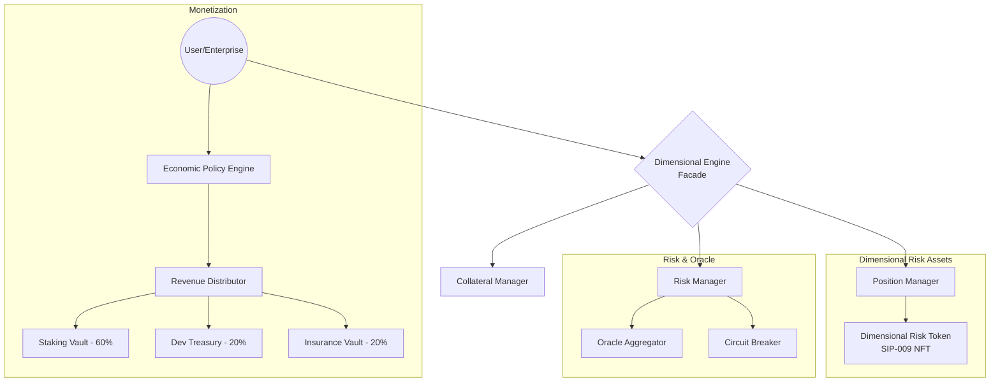
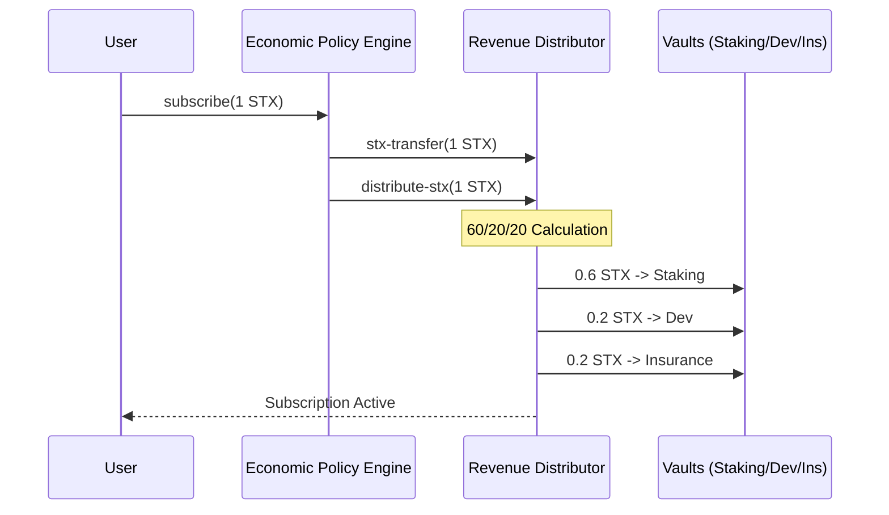
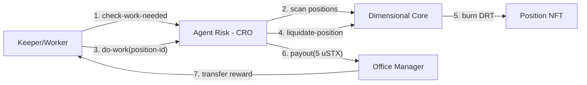
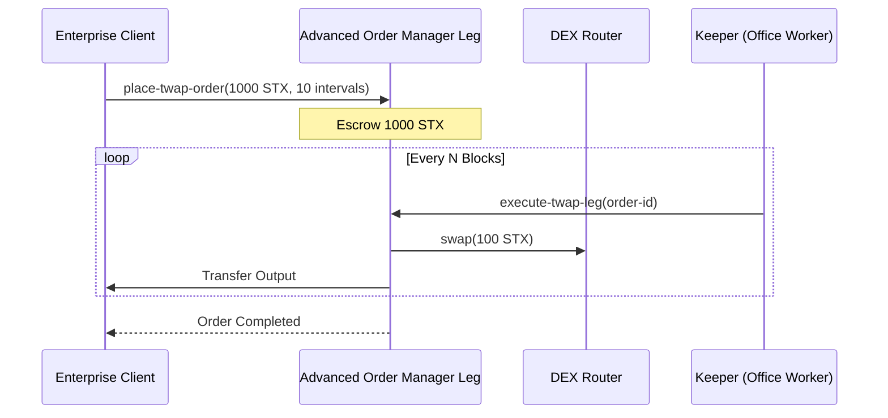

# Conxian Finance Protocol - System Wireframes

This document provides visual representations of the Conxian Protocol's core systems, architecture, and user journeys.

## 1. Core Architecture (Multi-Dimensional Facade)

The Conxian Protocol uses a Facade Pattern to separate user interactions from complex backend logic. All positions are represented as **Dimensional Risk Tokens (DRT)**.

## 2. Revenue Lifecycle (60/20/20 Split)

Every 1 STX subscription fee follows an autonomous distribution path.

## 3. Autonomous "Office Worker" Liquidation Loop

The CRO (Agent Risk) monitors system solvency and pays workers for executing liquidations.

## 4. Enterprise Advanced Order Flow (TWAP)

Large institutional orders are broken down into time-weighted intervals.

## 5. UI/UX Dashboard Wireframe (Conceptual)

The UI (housed in `conxian_ui`) reflects the "Dimensional" nature of the protocol.

| Navigation | Dimensional Dashboard | System Health |
| :--- | :--- | :--- |
| **Portfolio** | **Active Positions (DRTs)** | **APY**: 12.5% |
| **Trade** | [Position #42] | **Utilization**: 65% |
| **Lending** | Leverage: 5x \| Risk: Low | **Solvency**: 150% |
| **Governance** | [Position #45] | **Nakamoto Status**: Finalized |
| **Settings** | Leverage: 20x \| Risk: HIGH | **Insurance Fund**: 1M STX |

---
*Note: This wireframe is synchronized with the PRD and the current contract implementation.*
