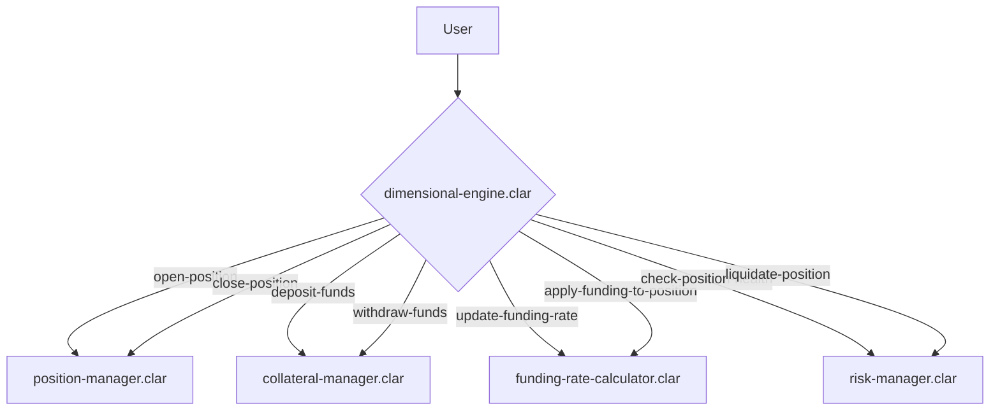

# Core Module

## Overview

The Core Module is the foundational layer of the Conxian Protocol, responsible for dimensional trading, position management, and system-wide risk assessment. It is designed around a secure, modular **facade pattern** where the `dimensional-engine.clar` contract serves as the single, unified entry point for all user-facing operations.

This architecture enhances security by abstracting the underlying complexity and ensures maintainability by routing calls to a set of specialized, single-responsibility manager contracts.

## Architecture: Facade Pattern

The Core Module's architecture is a clear implementation of the facade pattern. All external calls are directed to the `dimensional-engine.clar` contract, which contains minimal business logic. Its primary function is to validate inputs and delegate the actual work to the appropriate manager contract.

This interaction is governed by a set of standardized interfaces defined in `/contracts/traits/`.

### Control Flow Diagram

## Core Contracts

### Facade

-   **`dimensional-engine.clar`**: The central **facade** for the Core Module. It acts as the single, secure entry point for all position management, collateral, and risk-related calls. It implements no core logic itself; instead, it delegates every call to the specialized manager contracts.

### Manager Contracts (Single-Responsibility)

-   **`position-manager.clar`**: Manages the entire lifecycle of user trading positions, including opening, closing, and modifying them.
-   **`collateral-manager.clar`**: Handles all operations related to user collateral, including deposits, withdrawals, and balance tracking.
-   **`funding-rate-calculator.clar`**: Responsible for calculating and applying funding rates for perpetual markets, ensuring market balance.
-   **`risk-manager.clar`** (Located in `contracts/risk/`): Assesses the health of all open positions and manages the liquidation process for those that are under-collateralized.

### Protocol-Wide Contracts

-   **`conxian-protocol.clar`**: The main protocol coordinator, responsible for managing system-wide configurations, authorized contract addresses, and emergency controls.
-   **`protocol-fee-switch.clar`**: A centralized switch for routing protocol fees to their designated destinations, such as the treasury, staking rewards, or insurance funds.

## Public Functions (`dimensional-engine.clar`)

The following functions are exposed by the `dimensional-engine.clar` facade.

### Position Management

-   `open-position`: Opens a new trading position by delegating to the `position-manager`.
-   `close-position`: Closes an existing position by delegating to the `position-manager`.

### Collateral Management

-   `deposit-funds`: Deposits funds into the `collateral-manager`.
-   `withdraw-funds`: Withdraws funds from the `collateral-manager`.

### Funding Rate Management

-   `update-funding-rate`: Triggers an update of the funding rate via the `funding-rate-calculator`.
-   `apply-funding-to-position`: Applies the current funding rate to a specific position via the `funding-rate-calculator`.

### Risk Management

-   `check-position-health`: Checks the health of a position by delegating to the `risk-manager`.
-   `liquidate-position`: Initiates the liquidation of an unhealthy position via the `risk-manager`.
-   `set-risk-parameters`: Configures the risk parameters for the protocol.
-   `set-liquidation-rewards`: Configures the rewards for liquidators.
-   `set-insurance-fund`: Sets the insurance fund contract address.

### Protocol Administration

-   `set-protocol-coordinator`: Sets the address of the main protocol coordinator contract.

## Status

**Under Review**: The contracts in this module are currently undergoing a comprehensive review to ensure correctness, security, and full alignment with the modular trait architecture. While the core functionality is implemented, the contracts are not yet considered production-ready.
