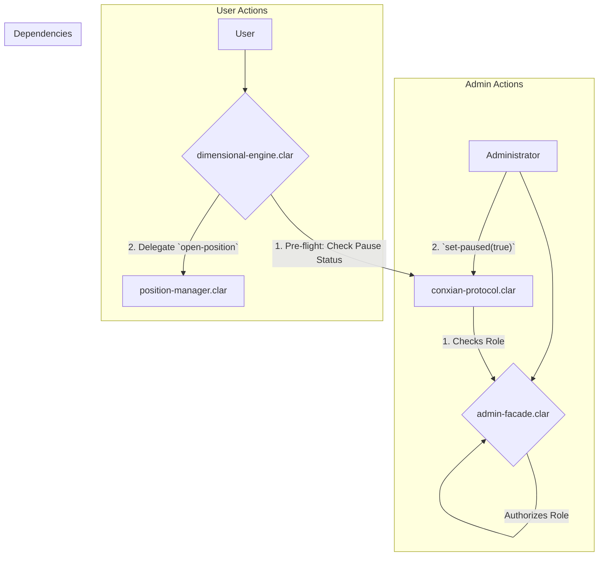

# Core Module

## Overview

The Core Module is the foundational layer and central nervous system of the Conxian Protocol. It manages global state, system-wide security, and routes all core user and administrative interactions. The architecture is designed for security, clarity, and gas efficiency by separating responsibilities into distinct, single-purpose contracts.

## Architecture: A Three-Contract System

The module operates on a three-contract model that separates administrative authorization, protocol state, and user-facing operations.

1.  **`admin-facade.clar` (Authorization Hub)**: This contract is the **single source of truth for all authorization and access control**. It manages roles (e.g., `ROLE_GLOBAL_ADMIN`, `ROLE_EMERGENCY_PAUSE`) and provides a centralized point for other contracts to verify permissions.

2.  **`conxian-protocol.clar` (Protocol State Coordinator)**: This contract manages the global state of the protocol. Its primary responsibilities include managing the system-wide emergency pause switch, maintaining a registry of all authorized module contracts, and handling contract ownership. It **delegates all authorization checks** to the `admin-facade.clar` contract.

3.  **`dimensional-engine.clar` (User Facade)**: ... (User entry point) ...

4.  **`ops-engine.clar` (The Heartbeat)**: Coordinates the protocol heartbeat by triggering Fast Path and Slow Path logic updates (CXIP-012). It incentivizes external keepers to maintain protocol health.

### Control Flow Diagram

## Core Contracts & Public Functions

### `admin-facade.clar` (Authorization Hub)

#### Authorization
-   `is-global-admin()`: (Read-Only) Checks if the caller is the global administrator.
-   `is-authorized(role uint)`: (Public) Checks if the caller is the global admin or has the specified role.
-   `is-authorized-to-pause(sender principal)`: (Read-Only) Checks if a given principal has permission to pause the protocol.

#### Role Management
-   `set-role(user principal, role uint, enabled bool)`: (Global Admin Only) Grants or revokes a specific role for a user.
-   `batch-update-roles(updates (list 100 {user: principal, role: uint, active: bool}))`: (Global Admin Only) Updates multiple user roles in a single transaction.

#### Emergency Functions
-   `set-emergency-pause(paused bool)`: (Emergency Role or Global Admin) Sets the local emergency pause status.
-   `pause-contract(target principal)`: (Emergency Role Only) Requests to pause a specific target contract.
-   `unpause-contract(target principal)`: (Global Admin Only) Requests to unpause a specific target contract.

#### Configuration
-   `set-global-admin(new-admin principal)`: (Global Admin Only) Transfers the global admin role to a new principal.
-   `transfer-global-admin-to-timelock()`: (Global Admin Only) Transfers the global admin role to the protocol timelock.
-   `set-rbac-contract(new-contract principal)`: (Global Admin Only) Sets the address of the RBAC contract.
-   `batch-admin-operations(operations (list 200 {type: uint, params: (list 5 principal)}))`: (Global Admin Only) Executes multiple administrative operations in a single transaction.

### `ops-engine.clar` (The Heartbeat)

-   `trigger-epoch-update()`: (Public) Incentivized function to trigger Anti-LVR updates (Fast Path) and Fiscal Dam/PID updates (Slow Path).
-   `process-signal(proposal-id uint, proposal-contract <proposal-trait>)`: (Operator Only) Executes governance signals.

### `conxian-protocol.clar` (Protocol State Coordinator)

#### Global State
-   `set-paused(new-paused bool)`: (Admin Only) Pauses or unpauses all state-changing protocol functions.
-   `is-paused()`: (Read-Only) Returns the current pause status of the protocol.
-   `get-protocol-status()`: (Read-Only) Returns a comprehensive status of the protocol, including Nakamoto tenure ID.

#### Module Registry
-   `register-module(name (string-ascii 32), contract principal)`: (Admin Only) Adds a new module contract to the protocol registry.
-   `get-module(name (string-ascii 32))`: (Read-Only) Retrieves the address and status of a registered module.

#### Ownership
-   `set-contract-owner(new-owner principal)`: (Admin Only) Transfers ownership of the protocol coordinator to a new address.
-   `get-admin()`: (Read-Only) Returns the current owner of the protocol.
-   `get-protocol-admin()`: (Read-Only) Returns the current owner of the protocol.

### `dimensional-engine.clar` (User Facade)

-   `open-position(position-manager <position-manager-trait>, token principal, amount uint, leverage uint, long bool, slippage-limit (optional uint), metadata (optional (string-utf8 1024)))`: Opens a new trading position.
-   `close-position(position-manager <position-manager-trait>, position-id uint, token principal, slippage-limit (optional uint))`: Closes an existing position.
-   `deposit-funds(collateral-manager <collateral-manager-trait>, amount uint, token-trait <sip-010-trait>)`: Deposits funds into the collateral manager.
-   `withdraw-funds(collateral-manager <collateral-manager-trait>, amount uint, token-trait <sip-010-trait>)`: Withdraws funds from the collateral manager.
-   `check-position-health(risk-manager <risk-manager-trait>, position-id uint)`: Queries position health via the risk manager.
-   `liquidate-position(risk-manager <risk-manager-trait>, position-id uint)`: Triggers liquidation of an unhealthy position.

## Status

**Aligned**: The Core module implementation matches the PRD architecture. The separation of concerns between authorization (`admin-facade`), state (`conxian-protocol`), and user interaction (`dimensional-engine`) is enforced across all core primitives.
