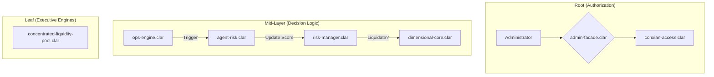

# Core Module

## Overview

The Core Module is the foundational layer and central nervous system of the Conxian Protocol. It manages global state, system-wide security, and routes all core user and administrative interactions. The architecture is designed for security, clarity, and gas efficiency by separating responsibilities into distinct, single-purpose contracts.

## Architecture: Root-to-Leaf Model

The module operates on a model that separates administrative authorization, protocol state, and specialized executive logic.

1. **`admin-facade.clar` (Authorization Hub)**: The **single source of truth for all authorization and access control**. It manages roles and provides a centralized point for other contracts to verify permissions.

2. **`conxian-protocol.clar` (Protocol State Coordinator)**: Manages the global state (pause switch, module registry). It delegates all authorization checks to the `admin-facade.clar`.

3. **`risk-manager.clar` (Centralized Risk Decisions)**: Consolidates all position health assessment and liquidation decision logic. It acts as the "Brain" for dimensional trading risk.

4. **`ops-engine.clar` (The Heartbeat)**: Coordinates the protocol heartbeat by triggering Fast Path (DEX) and Slow Path (Treasury/Risk) logic updates.

### Control Flow Diagram (Root-to-Leaf)



## Core Contracts & Public Functions

### `risk-manager.clar` (Centralized Risk Logic)

- `get-health-factor(position-id uint)`: (Public) Calculates and caches the health factor for a position.
- `liquidate(position-id uint)`: (Public) Consolidated liquidation entry point. Evaluates health vs system-wide risk before calling the executive engine.
- `update-system-risk(new-score uint)`: (Risk Agent Only) Updates the system-wide risk context used for decision making.

### `ops-engine.clar` (The Heartbeat)

- `trigger-epoch-update()`: (Public) Incentivized function to trigger Anti-LVR updates and Fiscal Dam/PID updates.
- `process-signal(proposal-id uint, proposal-contract <proposal-trait>)`: (Operator Only) Executes governance signals.

### `conxian-protocol.clar` (Protocol State Coordinator)

- `set-paused(new-paused bool)`: (Admin Only) Pauses or unpauses all state-changing protocol functions.
- `register-module(name (string-ascii 32), contract principal)`: (Admin Only) Adds a new module contract to the protocol registry.
- `get-protocol-status()`: (Read-Only) Returns a comprehensive status of the protocol, including Nakamoto tenure ID.

## Testing

To run the core module tests, use the following command:

```bash
npx vitest run tests/core-contracts.test.ts
```

Note: Integration tests may encounter `CircularReference` issues in Simnet. Refer to `GOVERNANCE_RECOVERY_REPORT.md` for mitigation strategies.

## Status

**Aligned**: The Core module implementation follows the Root-to-Leaf directive. Fragmented liquidation logic has been centralized, and TVL metrics have been normalized for cross-token accuracy.
