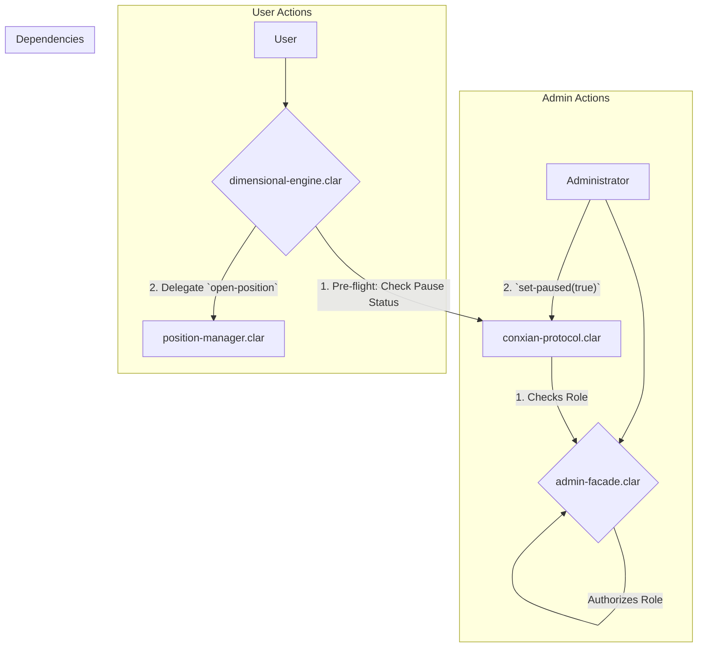

# Core Module

## Overview

The Core Module is the foundational layer and central nervous system of the Conxian Protocol. It manages global state, system-wide security, and routes all core user and administrative interactions. The architecture is designed for security, clarity, and gas efficiency by separating responsibilities into distinct, single-purpose contracts.

## Architecture: A Three-Contract System

The module operates on a three-contract model that separates administrative authorization, protocol state, and user-facing operations.

1.  **`admin-facade.clar` (Authorization Hub)**: This contract is the **single source of truth for all authorization and access control**. It manages roles (e.g., `ROLE_GLOBAL_ADMIN`, `ROLE_EMERGENCY_PAUSE`) and provides a centralized point for other contracts to verify permissions. This pattern significantly reduces redundant authorization logic across the protocol and optimizes gas costs by consolidating checks.

2.  **`conxian-protocol.clar` (Protocol State Coordinator)**: This contract manages the global state of the protocol. Its primary responsibilities include managing the system-wide emergency pause switch, maintaining a registry of all authorized module contracts, and handling contract ownership. It **delegates all authorization checks** to the `admin-facade.clar` contract.

3.  **`dimensional-engine.clar` (User Facade)**: This is the primary, user-facing entry point for all trading and position management. It validates user inputs and delegates the core logic to specialized manager contracts (e.g., `position-manager.clar`). Before executing any state-changing operations, it performs critical pre-flight checks by querying `conxian-protocol.clar` for the system's pause status.

### Control Flow Diagram

This diagram illustrates the separation of concerns between the three core contracts. Administrative actions are authorized by `admin-facade.clar` and executed in `conxian-protocol.clar`, while user actions are routed through `dimensional-engine.clar`.

## Core Contracts & Public Functions

### `admin-facade.clar` (Authorization Hub)

This contract centralizes all role-based access control (RBAC) to provide a single, gas-efficient source of truth for permissions.

#### Authorization
-   `is-global-admin()`: (Read-Only) Checks if the caller is the global administrator.
-   `is-authorized-to-pause(sender principal)`: (Read-Only) Checks if a given principal has permission to pause the protocol. This is a `;; BOLT:` optimization that consolidates multiple checks into a single function.
-   `has-role(role uint)`: (Read-Only) A generic function to check if the caller has a specific role.

#### Role Management
-   `set-role(user principal, role uint, enabled bool)`: (Global Admin Only) Grants or revokes a specific role for a user.
-   `batch-update-roles(updates (list 100 {user: principal, role: uint, active: bool}))`: (Global Admin Only) Updates multiple user roles in a single, gas-efficient transaction. This is a `;; BOLT:` optimization.

#### Emergency Functions
-   `set-emergency-pause(paused bool)`: (Emergency Role or Global Admin) Sets the emergency pause status.

#### Configuration
-   `set-global-admin(new-admin principal)`: (Global Admin Only) Transfers the global admin role to a new principal.
-   `set-rbac-contract(new-contract principal)`: (Global Admin Only) Sets the address of the RBAC contract.

### `conxian-protocol.clar` (Protocol State Coordinator)

This contract manages the protocol's global state and contract registry, delegating all authorization to `admin-facade.clar`.

#### Global State
-   `set-paused(new-paused bool)`: (Admin Only) Pauses or unpauses all state-changing protocol functions. Delegates authorization to `admin-facade.clar`.
-   `is-paused()`: (Read-Only) Returns the current pause status of the protocol.
-   `get-protocol-status()`: (Read-Only) Returns the pause status and the current Nakamoto tenure ID in a single, efficient call. This is a `;; BOLT:` optimization.

#### Module Registry
-   `register-module(name (string-ascii 32), contract principal)`: (Admin Only) Adds a new module contract to the protocol registry.
-   `batch-register-modules(modules-list (list 20 {name: (string-ascii 32), contract: principal}))`: (Admin Only) Registers multiple modules in a single transaction. A `;; BOLT:` optimization.
-   `set-module-active(name (string-ascii 32), active bool)`: (Admin Only) Activates or deactivates a registered module.
-   `batch-set-module-active(updates (list 20 {name: (string-ascii 32), active: bool}))`: (Admin Only) Updates the status of multiple modules in a single transaction. A `;; BOLT:` optimization.
-   `get-module(name (string-ascii 32))`: (Read-Only) Retrieves the address and status of a registered module.

#### Ownership
-   `set-contract-owner(new-owner principal)`: (Admin Only) Transfers ownership of the protocol to a new address.
-   `get-contract-owner()`: (Read-Only) Returns the current owner of the protocol.

### `dimensional-engine.clar` (User-Facing Facade)

This contract is the secure entry point for all user-facing trading operations. Its documentation is included for architectural context.

-   `open-position(...)`: Opens a new trading position.
-   `close-position(...)`: Closes an existing position.
-   `deposit-funds(...)`: Deposits funds into the collateral manager.
-   `withdraw-funds(...)`: Withdraws funds from the collateral manager.

## Status

**Aligned**: The contracts in this module have been aligned with the architecture described in the `PRD.md`. The separation of concerns between authorization (`admin-facade`), state (`conxian-protocol`), and user interaction (`dimensional-engine`) is now clearly documented.
