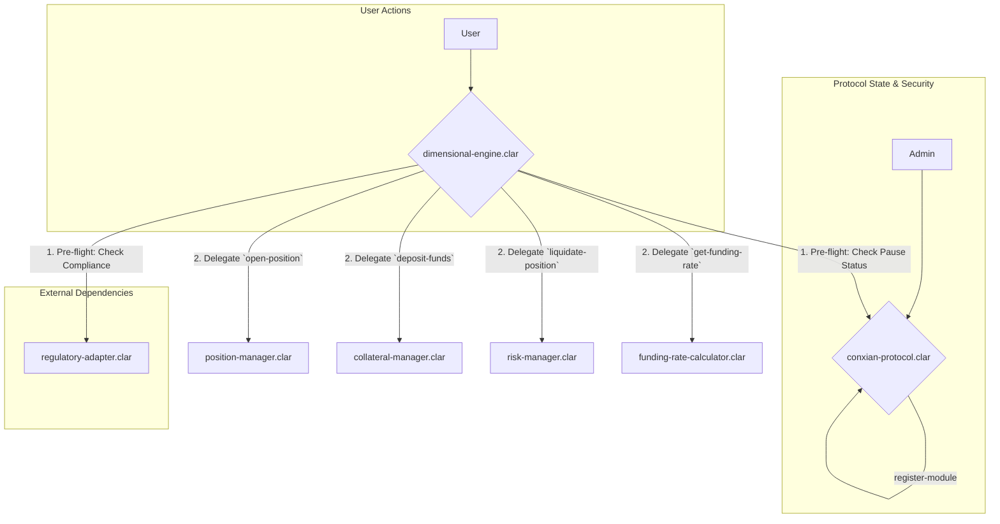

# Core Module

## Overview

The Core Module is the foundational layer and central nervous system of the Conxian Protocol. It is responsible for managing global state, system-wide security, and routing all core user interactions for dimensional trading, position management, and risk assessment.

The module is designed around a secure, modular **facade pattern**. The `dimensional-engine.clar` contract serves as the primary, user-facing entry point, while the `conxian-protocol.clar` contract acts as the central administrative hub. This architecture separates user actions from protocol administration and enforces system-wide rules.

## Architecture: Facade and Coordinator

The Core Module's architecture separates user interaction from protocol administration.

1.  **`dimensional-engine.clar` (User Facade)**: This contract is the single entry point for all standard user operations. It contains minimal business logic, instead validating inputs and delegating work to specialized manager contracts. Crucially, it performs pre-flight checks by querying other contracts for pause status (`conxian-protocol`) and regulatory compliance (`regulatory-adapter`).

2.  **`conxian-protocol.clar` (Protocol Coordinator)**: This is the administrative heart of the protocol. It manages a system-wide emergency pause switch, maintains a registry of all authorized module contracts, and handles ownership and administrative permissions.

### Control Flow Diagram

## Core Contracts

### Facade & Coordinator

-   **`dimensional-engine.clar`**: The user-facing **facade** for the Core Module. It is the single, secure entry point for all position management, collateral, and risk-related calls. It performs critical pre-flight checks before delegating calls to the appropriate manager contracts.
-   **`conxian-protocol.clar`**: The central **protocol coordinator**. It is responsible for managing system-wide configurations, the module contract registry, and the global emergency pause feature. All administrative actions are routed through this contract.

### Manager Contracts (Single-Responsibility)

-   **`position-manager.clar`**: Manages the entire lifecycle of user trading positions.
-   **`collateral-manager.clar`**: Handles all operations related to user collateral.
-   **`risk-manager.clar`**: Assesses the health of all open positions and manages the liquidation process.
-   **`funding-rate-calculator.clar`**: Calculates the funding rate for perpetual futures.

### Key Dependencies

-   **`regulatory-adapter.clar`**: A compliance contract that verifies a user's status via off-chain signed attestations, keeping PII off-chain.

## Public Functions

### `dimensional-engine.clar` (User-Facing)

#### Configuration
-   `set-protocol-coordinator(new-coordinator principal)`: (Owner Only) Sets the address of the main protocol coordinator contract.

#### Position Management
-   `open-position(token principal, amount uint, leverage uint, long bool, slippage-limit (optional uint), metadata (optional (string-utf8 1024)))`: Opens a new trading position.
-   `close-position(position-id uint, token principal, slippage-limit (optional uint))`: Closes an existing position.

#### Collateral Management
-   `deposit-funds(amount uint, token <sip-010-trait>)`: Deposits funds into the collateral manager.
-   `withdraw-funds(amount uint, token <sip-010-trait>)`: Withdraws funds from the collateral manager.

#### Risk Management
-   `check-position-health(position-id uint)`: (Read-Only) Checks the health factor of a specific position.
-   `liquidate-position(position-id uint)`: Initiates the liquidation of an unhealthy position.

### `conxian-protocol.clar` (Admin-Facing)

#### Global State
-   `set-paused(new-paused bool)`: (Admin Only) Pauses or unpauses all state-changing protocol functions.
-   `is-paused()`: (Read-Only) Returns the current pause status of the protocol.
-   `get-protocol-status()`: (Read-Only) Returns the pause status and the current Nakamoto tenure ID.

#### Module Registry
-   `register-module(name (string-ascii 32), contract principal)`: (Admin Only) Adds a new module contract to the protocol registry.
-   `set-module-active(name (string-ascii 32), active bool)`: (Admin Only) Activates or deactivates a registered module.
-   `get-module(name (string-ascii 32))`: (Read-Only) Retrieves the address and status of a registered module.

#### Ownership
-   `set-contract-owner(new-owner principal)`: (Owner Only) Transfers ownership of the protocol to a new address.
-   `get-contract-owner()`: (Read-Only) Returns the current owner of the protocol.

## Status

**Under Review**: The contracts in this module are currently undergoing a comprehensive review to ensure correctness, security, and full alignment with the modular trait architecture. While the core functionality is implemented, the contracts are not yet considered production-ready.
