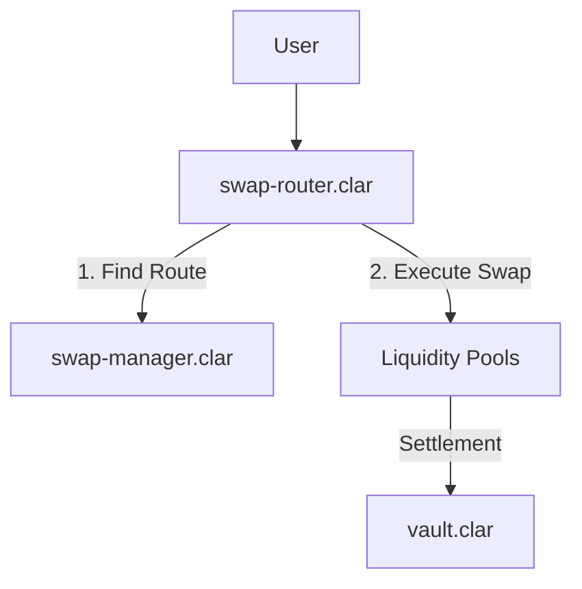

# DEX Module

## Overview

The DEX Module provides a highly efficient and capital-aware decentralized exchange for the Conxian Protocol. It is architected for flexibility, supporting multiple pool types and optimized trading routes through a modular execution layer.

## Architecture: Multi-Layer Execution

The DEX module separates concerns into three distinct layers:

1. **User Facade (`swap-router.clar`)**: The primary entry point for users. Handles single and multi-hop swaps across registered pools.
2. **Coordination Layer (`swap-manager.clar`)**: Manages route discovery, performance tracking, and caching for optimal trade execution.
3. **Storage Layer (`vault.clar`)**: Provides secure asset storage and management for protocol-owned and user-managed liquidity.

### Control Flow Diagram



## Core Contracts

### `swap-router.clar` (User Facade)

Handles user-facing swap operations. It is Nakamoto-aligned and tenure-aware.

- `exact-input-single(pool-id uint, token-in <sip-010-ft-trait>, token-out <sip-010-ft-trait>, amount-in uint, min-amount-out uint)`: Performs a swap across a single pool.
- `exact-input-multi(pool-ids (list 5 uint), tokens (list 6 principal), amount-in uint, min-amount-out uint)`: Coordinates swaps across multiple hops.
- `update-volatility-fees()`: (Public) Fast Path trigger to adjust pool fees based on instant volatility (Anti-LVR).

### `swap-manager.clar` (Coordination)

Optimizes trade execution by identifying the most efficient routes and caching results.

- `find-best-route(token-in principal, token-out principal, amount-in uint)`: Determines the optimal path for a swap.
- `execute-swap(route-id (buff 32), amount-in uint, min-amount-out uint, max-slippage uint)`: Executes a coordinated swap along a discovered route.
- `batch-execute-swaps(swaps (list 10 {route-id: (buff 32), amount-in: uint, min-amount-out: uint, max-slippage: uint}))`: Allows for multiple swaps in a single transaction.

### `concentrated-liquidity-pool.clar` (Core Engine)

The singleton contract managing all concentrated liquidity pools and fee collection.

- `create-pool(token0 principal, token1 principal, fee uint, sqrt-price uint)`: Deploys a new pool for a token pair.
- `swap(pool-id uint, zero-for-one bool, amount-in uint, token0-trait <sip-010-ft-trait>, token1-trait <sip-010-ft-trait>)`: Executes trades against a specific pool ID.
- `mint(pool-id uint, tick-lower int, tick-upper int, amount uint)`: Adds liquidity to a specific tick range.
- `collect-protocol-fees(token-trait <sip-010-ft-trait>)`: Sweeps accumulated fees to the Revenue Distributor.
- `set-pool-fee(pool-id uint, new-fee uint)`: (Public) Authorized update of the pool fee parameter.

### `vault.clar` (Asset Management)

The protocol's secure storage system for assets.

- `create-vault(vault-type (string-ascii 32), tokens (list 10 principal), metadata (string-ascii 256))`: Initializes a new secure storage instance.
- `deposit-to-vault(vault-id (buff 32), token-trait <sip-010-ft-trait>, amount uint)`: Safely stores assets in a vault.
- `withdraw-from-vault(vault-id (buff 32), token-trait <sip-010-ft-trait>, amount uint)`: Retrieves assets from a vault.

## Integration Examples

### Executing a Simple Swap

Users should interact with the `swap-router` for all trading operations.

```clarity
(contract-call? .swap-router exact-input-single
  u1             ;; pool-id
  .stx-token     ;; token-in
  .cxd-token     ;; token-out
  u1000000       ;; amount-in
  u950000        ;; min-amount-out (5% slippage)
)
```

## Status

**Aligned**: The core contracts have been verified for Nakamoto compatibility. All lambda patterns have been removed in favor of `fold` and `map` operations.
