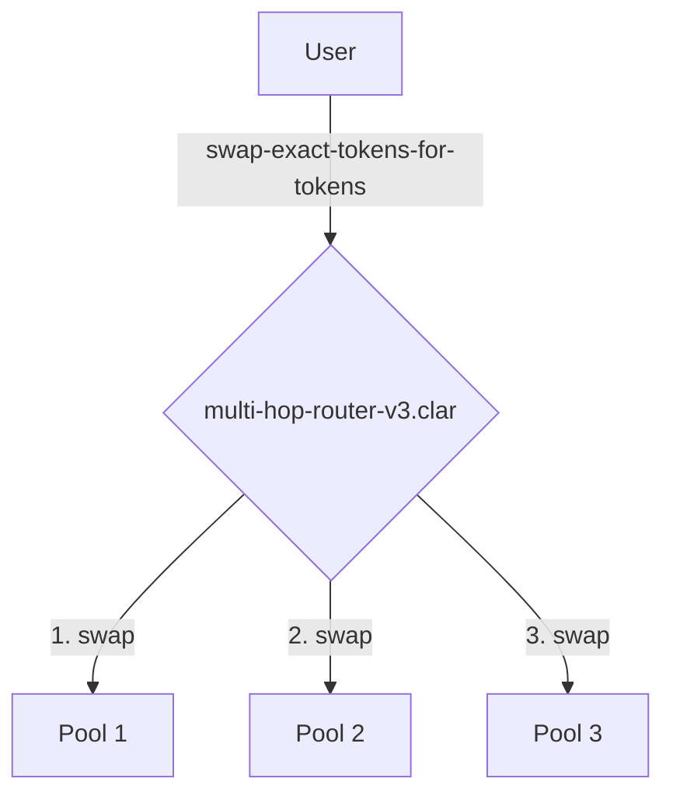

# Module: DEX

## Overview

The DEX Module provides a highly efficient and capital-aware decentralized exchange. It is architected to be flexible and extensible, supporting multiple pool types and optimized trading routes. The module separates the concerns of trade execution, pool creation, and liquidity management into distinct, specialized contracts.

## Architecture: Multi-Hop Router

The current implementation of the DEX module uses an advanced execution facade, `multi-hop-router-v3.clar`, which provides a single entry point for complex swap operations. This contract can interact with multiple liquidity pools to execute trades across a predefined path.

### Control Flow Diagram

## Core Contracts

### Execution Facade

- **`multi-hop-router-v3.clar`**: The **facade** for trade execution. It provides an interface for performing swaps across multiple liquidity pools in a single atomic transaction.

### Pool Implementation

- **`concentrated-liquidity-pool.clar`**: The primary AMM for volatile asset pairs. It allows liquidity providers to concentrate their capital within specific price ranges, providing greater capital efficiency. Key features include tick-based liquidity management and position NFTs.
- **`stable-swap-pool.clar`**: An AMM optimized for stablecoin swaps, using a different curve to minimize slippage.
- **`weighted-swap-pool.clar`**: An AMM that allows for pools with more than two assets and custom weightings.

### Factories and Registries

- **`dex-factory.clar`**: A factory contract for creating new liquidity pools. It features a pool type registry that allows for the creation of different types of pools, including concentrated liquidity, stable swap, and weighted pools.
- **`pool-registry.clar`**: A registry of all active liquidity pools.

## Public Functions (`multi-hop-router.clar`)

- `swap-exact-tokens-for-tokens(amount-in uint, amount-out-min uint, token-in principal, token-out principal)`: Executes a multi-hop swap for an exact input amount. It uses Dijkstra's algorithm to find the optimal path across all available pools.

## Status

**Under Review**: The contracts in this module are currently undergoing a comprehensive review. While the core swapping functionality in `multi-hop-router.clar` is stable, the surrounding factory and registry contracts are being refined to ensure full alignment with the protocol's modular architecture. These contracts are not yet considered production-ready.
