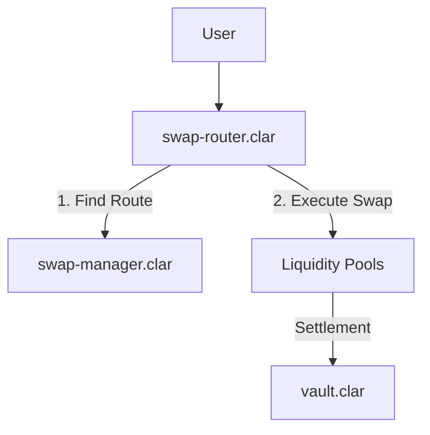

# DEX Module

## Overview

The DEX Module provides a highly efficient and capital-aware decentralized exchange for the Conxian Protocol. It is architected for flexibility, supporting multiple pool types and optimized trading routes through a modular execution layer.

## Architecture: Multi-Layer Execution

The DEX module separates concerns into three distinct layers:

1. **User Facade (`swap-router.clar`)**: The primary entry point for users. Handles single and multi-hop swaps across registered pools.
2. **Coordination Layer (`swap-manager.clar`)**: Manages route discovery, performance tracking, and caching for optimal trade execution.
3. **Storage Layer (`vault.clar`)**: Provides secure asset storage and management for protocol-owned and user-managed liquidity.

### Control Flow Diagram



## Core Contracts

### Active Contracts

#### `swap-router.clar` (User Facade)

Handles user-facing swap operations. It is Nakamoto-aligned and tenure-aware.

- `exact-input-single(...)`: Performs a swap across a single pool.
- `exact-input-multi(...)`: Coordinates swaps across multiple hops.

#### `swap-manager.clar` (Coordination)

Optimizes trade execution by identifying the most efficient routes and caching results.

- `update-volatility-fees()`: Updates fees based on market volatility (keeper function).

#### `concentrated-liquidity-pool.clar` (Core Engine)

The singleton contract managing all concentrated liquidity pools and fee collection.

- `create-pool(...)`: Deploys a new pool for a token pair.
- `swap(...)`: Executes trades against a specific pool ID.
- `mint(...)`: Adds liquidity to a specific tick range.
- `collect-protocol-fees(...)`: Sweeps accumulated fees to the Revenue Distributor.

#### `vault.clar` (Asset Management)

The protocol's secure storage system for assets.

- `create-vault(...)`: Initializes a new secure storage instance.
- `deposit-to-vault(...)`: Safely stores assets in a vault.
- `withdraw-from-vault(...)`: Retrieves assets from a vault.

### 🚧 Stub Contracts (Future Implementation)

The following contracts are placeholders for future DEX features:

| Contract | Status | Planned Functionality |
|----------|--------|----------------------|
| `batch-auction.clar` | 🚧 Stub | Batch execution for MEV protection |
| `real-time-monitoring-dashboard.clar` | 🚧 Stub | DEX analytics and monitoring |
| `price-impact-calculator.clar` | 🚧 Stub | Slippage estimation tools |
| `pool-type-registry.clar` | 🚧 Stub | Multi-pool type management |
| `pool-implementation-registry.clar` | 🚧 Stub | Pool template registry |
| `nakamoto-compatibility.clar` | 🚧 Stub | Nakamoto-specific optimizations |
| `on-chain-router-helper.clar` | 🚧 Stub | Router optimization utilities |
| `distributed-cache-manager.clar` | 🚧 Stub | Oracle price caching layer |
| `cxlp-migration-queue.clar` | 🚧 Stub | LP token migration system |
| `dex-registrar.clar` | 🚧 Stub | DEX registry management |
| `cxvg-utility.clar` | 🚧 Stub | CXVG token DEX utilities |
| `enterprise-loan-manager.clar` | 🚧 Stub | B2B lending integration |
| `rebalancing-rules.clar` | 🚧 Stub | Auto-rebalancing for vaults |
| `predictive-scaling-system.clar` | 🚧 Stub | Dynamic gas/liquidity scaling |
| `protocol-invariant-monitor.clar` | 🚧 Stub | Safety check automation |

## Integration Examples

### Executing a Simple Swap

Users should interact with the `swap-router` for all trading operations.

```clarity
(contract-call? .swap-router exact-input-single
  .pool-stx-cxd
  .stx-token
  .cxd-token
  u1000000 ;; amount-in
  u950000  ;; min-amount-out (5% slippage)
)
```

### Finding an Optimal Route

Integrators can query the `swap-manager` to find the most efficient path for a trade.

```clarity
(contract-call? .swap-manager find-best-route
  .stx-token
  .cxd-token
  u1000000
)
```

## Testing

### Automated Tests

DEX functionality is verified through a suite of integration tests.

Run DEX tests:

```bash
npm test -- tests/dex-defi.test.ts
```

## Status

**Aligned**: The core contracts (`swap-router`, `swap-manager`, `vault`) have been remediated to remove non-Clarity patterns (like lambdas) and aligned with Nakamoto-era standards.
