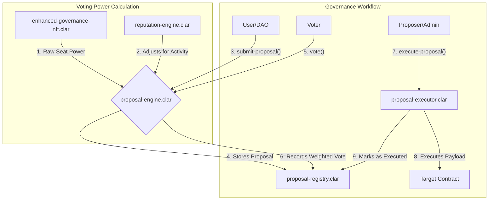

# Governance Module

## Overview

The Governance Module provides the framework for decentralized decision-making and protocol upgrades. It is designed to be secure, transparent, and flexible, enabling the community to propose, vote on, and execute changes. The module also features the **Conxian Operations Engine**, an automated on-chain agent that can participate in governance.

## Architecture: Logic-Rich Facade and Specialized Managers

The Governance Module is architected around a **logic-rich facade**. The `proposal-engine.clar` contract serves as the primary controller, acting as the secure, unified entry point for all governance actions.

Unlike a pure facade, the `proposal-engine.clar` contains significant business logic. It is responsible for enforcing the core rules of the governance process, such as validating proposal timings, checking voting eligibility, and managing the overall state of a proposal. While it orchestrates the process, it delegates specialized tasks to the manager contracts below.

### Control Flow Diagram

## Core Contracts

### Logic-Rich Facade

-   **`proposal-engine.clar`**: The primary **controller** for the governance module. It provides a unified interface for creating proposals, casting votes, and queuing execution. It enforces the core business logic of the governance process and delegates specialized tasks like data storage and vote counting to the manager contracts.

### Manager Contracts

-   **`proposal-registry.clar`**: A specialized contract responsible for both storing proposal data and recording all votes cast against them.
-   **`proposal-executor.clar`**: A dedicated contract for executing general governance proposals after they have passed. It validates quorum requirements before executing a proposal's payload.
-   **`upgrade-controller.clar`**: A specialized, high-security contract for managing the execution of sensitive protocol upgrades. This contract is independent of the main proposal engine and incorporates additional safety features like timelocks.

### Supporting Contracts

-   **`enhanced-governance-nft.clar`**: Implements the NFT-based council and role system. It is the source of a voter's "raw" voting power, based on which council seats they hold.
-   **`reputation-engine.clar`**: A supporting contract that adjusts a voter's raw power based on their activity and historical participation. The `proposal-engine.clar` queries this contract to get a "weighted" voting power, which is used to calculate the final vote.

### Automated Governance Agent

-   **`conxian-operations-engine.clar`**: An automated agent that can hold a formal seat in the DAO. It is designed to consume on-chain metrics and participate in governance by calling the `proposal-engine.clar`, although its logic is currently under development.

## Public Functions

### `proposal-engine.clar` (User-Facing)

-   `submit-proposal(proposal-contract <.governance-traits.proposal-trait>, council-id uint, start-block uint, end-block uint)`: Submits a new proposal for voting.
-   `vote(proposal-id uint, support bool)`: Casts a vote on an active proposal. The weight of the vote is determined by the combination of the voter's NFT-based seat power and their reputation score.
-   `execute-proposal(proposal-id uint, proposal-contract <.governance-traits.proposal-trait>)`: Triggers the execution of a passed proposal by calling the `proposal-executor`.

### `proposal-executor.clar` (System-Facing)

-   `execute(proposal-id uint, proposal-contract <.governance-traits.proposal-trait>, quorum-percentage uint)`: Called by the `proposal-engine` to execute a passed proposal. It verifies that the voting period is over, the proposal passed, and the quorum was met before executing the proposal's logic.

## Status

**Aligned**: The Governance module implements the Dual-Council (Staff vs Board) architecture. It is fully integrated with the `reputation-engine` and aligned with Clarity 4 security standards.
