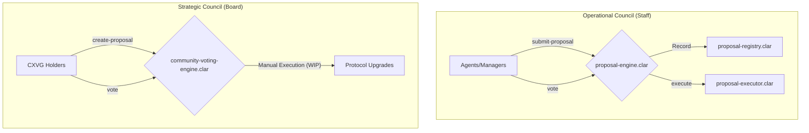

# Governance Module

## Overview

The Governance Module provides the framework for decentralized decision-making and protocol upgrades. It implements a **Dual-Council Governance Model** (Staff vs Board), separating daily operational management from long-term strategic decisions.

## Architecture: Dual-Council System

The module is architected around two specialized voting engines:

1.  **Operational Council (Staff)**: Managed via `proposal-engine.clar`. This is a high-velocity, 24/7 engine used by autonomous agents and core managers for parameter tuning and emergency responses.
2.  **Strategic Council (Board/AGM)**: Managed via `community-voting-engine.clar`. This engine is used for high-quorum, long-duration votes by CXVG token holders, typically during Annual General Meetings (AGM).

### Control Flow Diagram

## Core Contracts

### Operational Engine (Staff)

-   **`proposal-engine.clar`**: The primary controller for daily operations. It routes proposals to the registry and coordinates execution via the executor. It uses `burn-block-height` for temporal logic.
-   **`proposal-executor.clar`**: Validates quorums and executes the payload of passed operational proposals.
-   **`proposal-registry.clar`**: The unified data store for all operational proposals and vote receipts.

### Strategic Engine (Board)

-   **`community-voting-engine.clar`**: Manages strategic proposals using the CXVG token. It enforces "Clean-Hands" compliance via the `regulatory-adapter` and features long voting periods (~1 year AGM interval).

### Supporting Infrastructure

-   **`reputation-engine.clar`**: Adjusts a voter's raw power based on activity and historical participation.
-   **`enhanced-governance-nft.clar`**: Manages council seat power for the Operational Council.
-   **`cxvg-token.clar`**: The strategic governance token used by the Board.
-   **`timelock.clar`**: Enforces execution delays for high-sensitivity governance actions.

## Public Functions

### `proposal-engine.clar` (Operational)

-   `submit-proposal(proposal-contract <proposal-trait>, council-id uint, start-block uint, end-block uint)`: Submits a new operational proposal.
-   `vote(proposal-id uint, support bool)`: Casts a vote weighted by seat power and reputation.
-   `execute-proposal(proposal-id uint, proposal-contract <proposal-trait>)`: Triggers execution via the `proposal-executor`.

### `community-voting-engine.clar` (Strategic)

-   `create-proposal(start-time uint, end-time uint)`: Creates a new strategic community proposal.
-   `vote(proposal-id uint, support bool)`: Casts a vote using CXVG tokens, weighted by reputation.

### `proposal-executor.clar`

-   `execute(proposal-id uint, proposal-contract <proposal-trait>, quorum-percentage uint)`: Validates and executes a passed operational proposal.

## Status

**Aligned**: The Governance module fully implements the Dual-Council architecture. Operational tasks are handled by "Staff" agents via the `proposal-engine`, while strategic shifts are reserved for "Board" members via the `community-voting-engine`.
