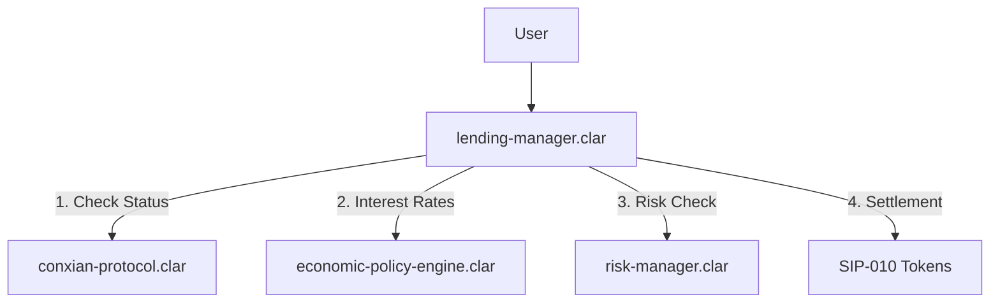

# Lending Module

## Overview

The Lending Module provides a decentralized money market for the Conxian Protocol. It allows users to supply assets to earn interest and borrow assets by providing collateral. The module is integrated with the `economic-policy-engine` for dynamic interest rate management and the `conxian-protocol` for global status coordination.

## Architecture: Automated Money Market

The lending module is centered around a unified manager that handles all user interactions and reserve tracking.

### Control Flow Diagram



## Core Contracts

### `lending-manager.clar`

The central hub for all lending operations.

- `deposit(...)`: Supply assets to the protocol.
- `borrow(...)`: Withdraw assets against collateral.
- `repay(...)`: Return borrowed assets.
- `seize-collateral(...)`: Transfer collateral from defaulter to liquidator (Risk Manager only).
- `collect-reserves(...)`: Sweep accumulated Protocol Revenue (Reserve Factor) to the Distributor.

## Revenue Model

The protocol charges a **Reserve Factor** (default 10%) on all accrued interest.

- `Supplier Interest` = `Total Interest` * (1 - Reserve Factor)
- `Protocol Revenue` = `Total Interest` * Reserve Factor

## Integration Examples

### Supplying Assets

Users can supply any supported SIP-010 token to the lending pool.

```clarity
(contract-call? .lending-manager deposit
  .cxd-token
  u1000000
)
```

### Borrowing Assets

Borrowing requires sufficient collateral in the protocol.

```clarity
(contract-call? .lending-manager borrow
  .stx-token
  u500000
)
```

## Testing

### Automated Tests

Lending logic is verified through a suite of market simulation tests.

Run lending tests:

```bash
npm test -- tests/lending/
```

## Status

**Aligned**: The `lending-manager.clar` has been remediated to align with Nakamoto standards and unified protocol authorization.
