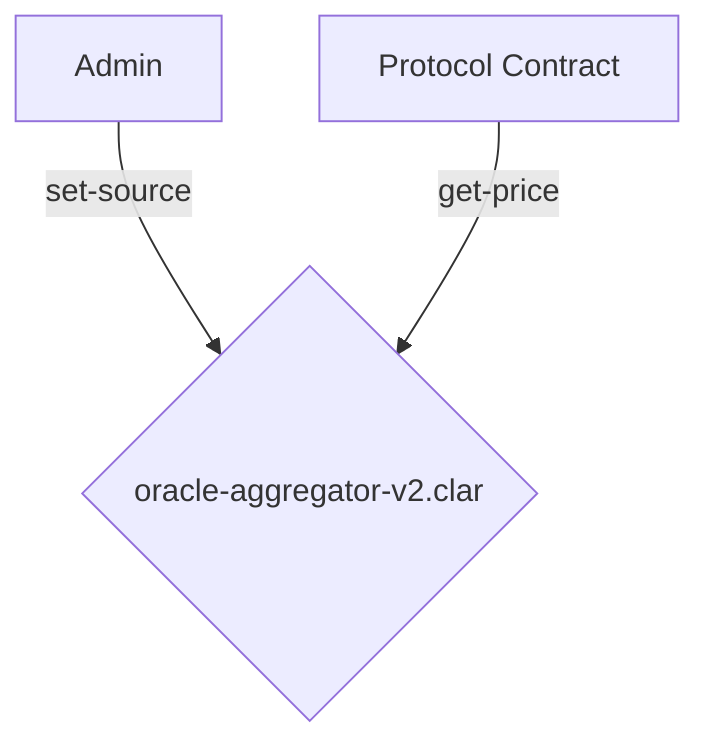

# Oracle Module

## Overview

The Oracle Module provides a simple, on-chain price feed system for the Conxian Protocol. It is designed to be a reliable source of price data for other modules, such as the DEX and lending protocols.

## Architecture

The module consists of a single contract, `oracle-aggregator-v2.clar`, which is responsible for storing, managing, and retrieving asset prices. The contract is designed to be updated by a trusted admin, and it includes basic security features to mitigate price manipulation.

### Control Flow Diagram

## Core Contracts

-   **`oracle-aggregator-v2.clar`**: The primary oracle contract. It stores the latest price for each asset, along with a Time-Weighted Average Price (TWAP) calculated using an Exponential Moving Average (EMA).

## Security Features

The `oracle-aggregator-v2.clar` contract includes the following security features:

-   **Manipulation Detection**: The contract compares the latest price update with the current TWAP. If the deviation exceeds a configurable threshold, the `is-manipulated` function will return `true`. In this "degraded mode," the `get-price` function will return the TWAP instead of the latest price, providing a more stable, manipulation-resistant price.
-   **Stale Price Threshold**: If a price has not been updated for a certain number of blocks, it is considered stale. In this case, `get-price` will also return the TWAP.
-   **Circuit Breaker**: The contract can be connected to a circuit breaker contract. If the circuit is open, `get-price` will return the TWAP.

## Public Functions

### `oracle-aggregator-v2.clar`

#### Admin Functions
-   `set-admin(new-admin principal)`: Sets a new admin for the contract.
-   `set-circuit-breaker(cb principal)`: Sets the circuit breaker contract.
-   `set-params(new-threshold-bps uint, new-alpha-bps uint)`: Sets the manipulation threshold and the TWAP alpha (the weight of the new price in the EMA calculation).
-   `set-stale-threshold(blocks uint)`: Sets the stale price threshold in blocks.
-   `set-source(asset principal, price uint, weight uint)`: Updates the price for a specific asset.

#### Read-Only Functions
-   `is-manipulated(asset principal)`: (Read-Only) Checks if the latest price for an asset is considered manipulated.
-   `get-price(asset principal)`: (Read-Only) Returns the latest price for an asset, or the TWAP if the price is stale or manipulated.
-   `get-twap(asset principal)`: (Read-Only) Returns the Time-Weighted Average Price (TWAP) for an asset.
-   `check-circuit-breaker()`: (Read-Only) Checks the status of the circuit breaker.

## Status

**Under Review**: The `oracle-aggregator-v2.clar` contract is currently undergoing a comprehensive review. While it provides basic oracle functionality, it is not yet considered production-ready.
