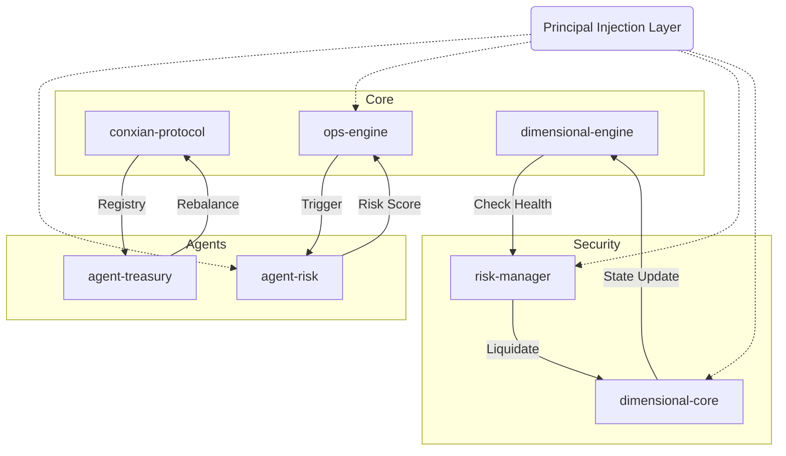

# Conxian Protocol: Circular Dependency & Environment Failure Mindmap

## 1. Identified Circular Dependencies (Simnet)

The following primary cycles prevent the `clarinet-sdk` from initializing the simnet environment correctly:

### A. The Core-Agent Loop
`ops-engine.clar` -> `agent-risk.clar` (trigger-epoch-update calls update-pid-rates)
`agent-risk.clar` -> `ops-engine.clar` (risk scores fed into ops-engine for defensive actions)

### B. The Governance-Treasury Loop
`governance-handover.clar` -> `agent-treasury.clar` (handover requires treasury state)
`agent-treasury.clar` -> `governance-handover.clar` (treasury rebalancing may trigger handover alerts)

### C. The Executive-Risk Loop
`dimensional-engine.clar` -> `risk-manager.clar` (engine checks health via risk-manager)
`risk-manager.clar` -> `dimensional-core.clar` (risk-manager triggers liquidation in core)
`dimensional-core.clar` -> `dimensional-engine.clar` (core notifies engine of state changes)

---

## 2. Environment Failures & Root Causes

### A. Asynchronous Race Conditions
- **Failure**: `tests/setup-test-env.ts` initialization fails intermittently.
- **Root Cause**: Simnet accounts are randomized per session, but deployment plans often use hardcoded principals.
- **Remediation**: Use a Singleton/Proxy pattern to manage a shared simnet instance and resolve account addresses dynamically at runtime.

### B. Clarity 4 Simulation Gap
- **Failure**: Native keywords like `stacks-block-time` and `contract-hash?` cause "Unresolved Function" errors in Simnet.
- **Root Cause**: `clarinet-sdk` v3.14.0 supports Clarity 4 syntax but the underlying interpreter sometimes lacks the full Nakamoto keyword suite.
- **Remediation**: Utilize `block-utils.clar` as a shim/adapter layer that uses `burn-block-height` in simulation and native keywords in production.

### C. Type Mismatches (Response vs. Bool)
- **Failure**: Tests fail when a contract expects a `(response bool uint)` but receives just `bool`.
- **Root Cause**: Fragmented refactoring of trait implementations.
- **Remediation**: Enforce the "Response-First" standard across all functional interfaces.

---

## 3. Repair Roadmap & Mindmap

### Phase 1: Structural Decoupling (The "Principal Injection" Refactor)
- [ ] **Remove Hardcoded Principals**: Replace all `.contract-name` references in `define-constant` and `define-data-var` with placeholder principals.
- [ ] **Implement Initializers**: Add `initialize` or `set-module-contract` functions to all core contracts.
- [ ] **Post-Deployment Wiring**: Update deployment scripts to "wire" the contracts together *after* they are deployed, breaking the static dependency graph.

### Phase 2: Simulation Stabilization
- [ ] **Dynamic Account Resolution**: Update all test suites to fetch accounts from `simnet.getAccounts()` instead of using hardcoded strings.
- [ ] **Trait Standardization**: Audit all trait implementations (`core-traits`, `defi-traits`) to ensure return types are unified (SIP-010/SIP-009 compliant responses).

### Phase 3: Verification & Load Testing
- [ ] **Root-to-Leaf Integration**: Verify system integrity starting from the `ops-engine` heartbeat.
- [ ] **Chaos Engineering**: Implement fuzz testing for the `agent-risk` PID controller to ensure stability under simulated mempool congestion.

---

## 4. Visualizing the Dependency Graph (Conceptual)

---
*Generated by Jules AI - System Architect (Feb 2026)*
