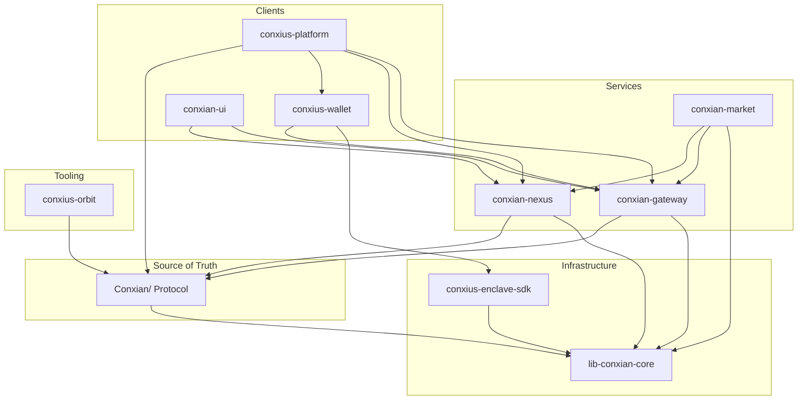

# M2M Context Matrix

> **Purpose:** This document defines the cross-repo context dependencies for native machine-to-machine (M2M) communication in the Conxian ecosystem.
>
> **Version:** 1.0 (2026-07-14)
> **Authority:** `conxian-business` (BOS)

---

## Overview

For autonomous M2M operation, each submodule must:

1. **Know what it depends on** (upstream providers)
2. **Know what depends on it** (downstream consumers)
3. **Expose stable interfaces** (APIs, contracts)
4. **Follow shared conventions** (types, errors, naming)

---

## Repository Dependency Graph



---

## Context Matrix

### Conxian/ (Protocol)

| Aspect | Value |
|--------|-------|
| **Role** | Source of truth for on-chain state |
| **Language** | Clarity 4 |
| **Depends On** | Nothing (root) |
| **Depended On By** | conxian-gateway, conxian-nexus, conxius-orbit, conxius-wallet |
| **Exposes** | Smart contracts (221), Token interfaces (CXD, CXLP, CXVG) |
| **API** | ClarityVM RPC |
| **Key Files** | `contracts/**/*.clar` |
| **Context File** | `AGENTS.md` |

**Required Context for Consumers:**
```
- Contract principals: source from operational-treasury.clar
- Token decimals: CXD=u8, CXLP=u8, CXVG=u6
- SIP compliance: SIP-010 (FT), SIP-009 (NFT)
```

---

### conxian-gateway

| Aspect | Value |
|--------|-------|
| **Role** | B2B/B2G middleware, ISO 20022 bridge |
| **Language** | Rust |
| **Depends On** | lib-conxian-core, Conxian/ (protocol) |
| **Depended On By** | conxian-nexus, conxian-market, conxius-wallet, conxian-ui, conxius-platform |
| **Exposes** | REST API, x402 mandates, RPC pooling |
| **API Endpoints** | `/api/v1/*` |
| **Key Files** | `internal/api/src/`, `pkg/conxian-core/` |
| **Context File** | `AGENTS.md`, `docs/CROSS_REPO_STATUS.md` |

**Required Context for Consumers:**
```
- Base URL: from NEXUS_PUBLIC_URL env
- Auth: Bearer token via x402
- ZKC/SYI: via lib-conxian-core
- Health: GET /health
```

---

### conxian-nexus

| Aspect | Value |
|--------|-------|
| **Role** | Settlement layer, state services, telemetry |
| **Language** | Rust + Clarity |
| **Depends On** | lib-conxian-core, Conxian/ (protocol) |
| **Depended On By** | conxian-gateway, conxian-market, conxian-ui, conxius-platform |
| **Exposes** | State services, PPP tracker, settlement APIs |
| **API Endpoints** | `/api/rest/*`, `/api/analytics/*` |
| **Key Files** | `src/api/rest.rs`, `src/storage/` |
| **Context File** | N/A (add `AGENTS.md`) |

**Required Context for Consumers:**
```
- Base URL: NEXUS_PUBLIC_URL env
- Settlement: via Conxian/ contracts
- Storage: Kwil + Tableland adapters
- Health: GET /health
```

---

### conxian-market (NEW)

| Aspect | Value |
|--------|-------|
| **Role** | AI settlement core, ERC-8183 escrow, MCP handoffs |
| **Language** | Mixed (docs/specs focused) |
| **Depends On** | conxian-gateway, conxian-nexus, lib-conxian-core |
| **Depended On By** | conxius-wallet (future) |
| **Exposes** | MCP protocol, ERC-8183 interfaces |
| **Key Files** | `README.md`, `ROADMAP.md`, `docs/` |
| **Context File** | N/A (needs AGENTS.md) |

**Required Context for Consumers:**
```
- Orchestration: MCP-based handoffs
- Settlement: ERC-8183 escrow layer
- Integration: via Gateway RPC or Nexus state
```

---

### conxius-wallet

| Aspect | Value |
|--------|-------|
| **Role** | Android-first sovereign wallet |
| **Language** | TypeScript + Kotlin |
| **Depends On** | conxius-enclave-sdk, conxian-gateway |
| **Depended On By** | conxius-platform |
| **Exposes** | Wallet signing APIs, Silent Payments |
| **Key Files** | `android/core-bitcoin/`, `services/` |
| **Context File** | `AGENTS.md` (BOS_KNOWLEDGE_GRAPH.md) |

**Required Context for Consumers:**
```
- Signing: via CXN Guardian (Enclave SDK)
- Gateway: REST API calls
- Silent Payments: Babylon integration
```

---

### conxian-ui

| Aspect | Value |
|--------|-------|
| **Role** | Reference UI components |
| **Language** | TypeScript (Next.js) |
| **Depends On** | conxian-gateway, conxian-nexus |
| **Depended On By** | conxius-platform |
| **Exposes** | Web UI components |
| **API Calls** | `src/lib/api-services.ts` |
| **Context File** | `docs/README.md` |

**Required Context for Consumers:**
```
- Gateway API: via coreApi.ts
- Nexus: via Nexus service adapters
- Design: Ivory Foundation theme
```

---

### conxius-platform

| Aspect | Value |
|--------|-------|
| **Role** | Local stack orchestration |
| **Language** | TypeScript + Docker |
| **Depends On** | All other repos |
| **Depended On By** | Developers |
| **Exposes** | Docker compose, deployment scripts |
| **Key Files** | `services/*/`, `docker-compose.yml` |
| **Context File** | `AGENTS.md` |

**Required Context for Consumers:**
```
- Orchestration: full stack composition
- Services: gateway, nexus, wallet, ui
- DevEx: local dev environment
```

---

### conxius-enclave-sdk

| Aspect | Value |
|--------|-------|
| **Role** | TEE abstraction, key isolation |
| **Language** | Rust |
| **Depends On** | lib-conxian-core |
| **Depended On By** | conxius-wallet |
| **Exposes** | Hardware key operations |
| **Key Files** | `src/`, `contracts/` |
| **Context File** | `AGENTS.md`, `PRODUCTION_READINESS.md` |

**Required Context for Consumers:**
```
- Signing: Wallet::sign() interface
- Attestation: TEE quotes
- Key isolation: hardware boundary
```

---

### conxius-orbit

| Aspect | Value |
|--------|-------|
| **Role** | Stacks smart contract deployment |
| **Language** | TypeScript + Python |
| **Depends On** | Conxian/ (protocol) |
| **Depended On By** | Developers |
| **Exposes** | CLI commands |
| **Key Files** | `conxius_orbit_cli.py`, `cli/` |
| **Context File** | `AGENTS.md` |

**Required Context for Consumers:**
```
- Deploy: clarinet + deploy plans
- Clarinet: via conxius_orbit_cli.py
- Monitoring: dashboard commands
```

---

### lib-conxian-core

| Aspect | Value |
|--------|-------|
| **Role** | Shared primitives, Vault SDK |
| **Language** | Rust |
| **Depends On** | Nothing (foundation) |
| **Depended On By** | All Rust repos |
| **Exposes** | Types, state machines, interfaces |
| **Key Files** | `src/`, `pkg/conxian-core/` |
| **Context File** | `AGENTS.md` |

**Required Context for Consumers:**
```
- Types: canonical type definitions
- SDK: VaultSDK primitive
- Trust: T1/T2/T3 taxonomy
```

---

## Shared Conventions

### Error Codes

| Code | Meaning | Usage |
|------|---------|-------|
| `err-u501` | Not Implemented | Stub endpoints |
| `err-u503` | Service Unavailable | External deps down |
| `err-u400` | Bad Request | Invalid input |
| `err-u401` | Unauthorized | Auth failure |
| `err-u403` | Forbidden | Permission denied |

### Environment Variables

| Variable | Purpose | Typical Source |
|---------|---------|----------------|
| `NEXUS_PUBLIC_URL` | Nexus API base | conxian-nexus |
| `GATEWAY_URL` | Gateway API base | conxian-gateway |
| `SUPABASE_URL` | Backend DB | Infrastructure |
| `SUPABASE_ANON_KEY` | Backend auth | Infrastructure |

### Type Conventions

```typescript
// All API responses follow:
interface ApiResponse<T> {
  data: T;
  error?: string;
  timestamp: string;
}

// All Rust errors use:
type ConxianError = {
  code: string;
  message: string;
  context?: Record<string, unknown>;
};
```

---

## M2M Communication Patterns

### Pattern 1: Gateway → Nexus → Protocol

```
conxian-gateway 
  → calls conxian-nexus API 
    → settles via Conxian/ contracts
```

### Pattern 2: Wallet → Gateway → Protocol

```
conxius-wallet 
  → signs via conxius-enclave-sdk 
  → calls conxian-gateway API 
    → settles via Conxian/ contracts
```

### Pattern 3: Market → Gateway/Nexus

```
conxian-market 
  → orchestrates via MCP 
  → settles via conxian-gateway 
  → state via conxian-nexus
```

### Pattern 4: UI → Gateway/Nexus

```
conxian-ui 
  → consumes conxian-gateway API 
  → reads conxian-nexus state
```

---

## Cross-Reference Checklist

When modifying any submodule, verify:

- [ ] Does this change affect exposed APIs?
- [ ] Are downstream consumers notified?
- [ ] Is lib-conxian-core updated if types change?
- [ ] Are error codes consistent?
- [ ] Is AGENTS.md updated with new context?

---

## Maintenance

**Crystallization:** After any cross-repo change, update this matrix and affected AGENTS.md files.

**Verification:** Run `scripts/init_session.sh --full` to ensure all context is synchronized.

---

*This document is the master M2M context reference. Submodules should link to it from their AGENTS.md files.*
