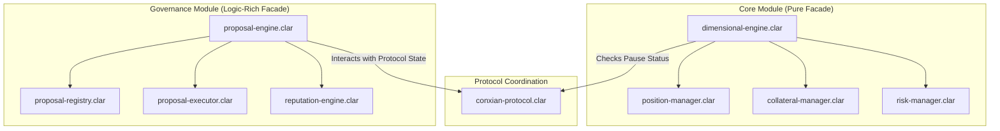

# Conxian Protocol: Product Requirement Document (PRD)

**Document Version**: 1.0 (Updated on an ongoing basis by Bolt ⚡)
**Project Status**: Technical Alpha (Testnet)

## 1. Overview & Vision

The Conxian Protocol is a sophisticated, multi-dimensional DeFi ecosystem architected on the Stacks blockchain. Our long-term vision is to build a **Sovereign Autonomous Business (SAB)**—a self-governing financial platform anchored to the security of Bitcoin.

This document serves as the central "source of truth" for the Conxian Protocol, outlining its architecture, governance model, and development roadmap. It is a living document, continuously updated to reflect the current state of the protocol.

**Core Principles:**

*   **Security**: Prioritizing the safety of user funds through battle-tested, clear, and auditable patterns.
*   **Maintainability**: Ensuring the long-term health and scalability of the protocol by separating concerns and creating a clean, understandable codebase.
*   **Extensibility**: Building a flexible foundation that allows for the seamless addition of new features and modules without compromising the stability of the core system.
*   **Nakamoto Readiness**: Actively developing to be fully compliant with the Stacks Nakamoto upgrade, leveraging the security and finality of Bitcoin.

***Disclaimer**: The Conxian Protocol is in a **Technical Alpha** stage. The features and systems described in this document represent our **target design**. While the foundational, facade-based architecture is in place on testnet, many of the advanced components are in earlier stages of development or are planned for future implementation. For the current status of the code, please refer to the module-specific `README` files.*

## 2. System Architecture

The Conxian Protocol is engineered with a modern, modular architecture, utilizing two primary patterns:

### 2.1. Pattern 1: The Pure Facade (Core Module)

*   **Description**: Provides a simple, stateless, and highly secure entry point to a module's functionality.
*   **Implementation**: Used in the `core` module, where `dimensional-engine.clar` acts as the facade. It performs pre-flight checks and delegates calls to specialized manager contracts, minimizing its own business logic and attack surface.

### 2.2. Pattern 2: The Logic-Rich Facade (Governance Module)

*   **Description**: A centralized controller that manages a complex, multi-step workflow.
*   **Implementation**: Used in the `governance` module, where `proposal-engine.clar` manages the entire lifecycle of a governance proposal, orchestrating interactions between various components like the `proposal-registry` and `proposal-executor`.

### 2.3. The Protocol Coordinator: `conxian-protocol.clar`

*   **Description**: The central nervous system of the protocol, serving as the single source of truth for protocol-wide state.
*   **Responsibilities**:
    *   **Emergency Pause**: A global flag to disable all state-changing functions in module facades.
    *   **Contract Registry**: Maintains a registry of all authorized module contracts.
    *   **Protocol-Wide Configuration**: Manages global configuration parameters.

### 2.4. High-Level System Diagram

## 3. Governance Model

The governance model is designed for a phased transition from a centralized structure to a fully decentralized, multi-council DAO.

### 3.1. Current Model: Technical Alpha

*   **Structure**: Centralized, multi-signature committee of the core development team.
*   **Rationale**: Prioritizes security and rapid response during the initial development phase. Critical functions are controlled by a `contract-owner` address.

### 3.2. Target Model: The Multi-Council DAO

*   **Structure**: A fully decentralized, on-chain governance system with specialized, elected bodies.
*   **Components**:
    *   **Proposal Engine Facade (`proposal-engine.clar`)**: The central entry point for all governance actions.
    *   **Multi-Council Structure**: Specialized councils for Protocol & Strategy, Risk & Compliance, Treasury & Investment, etc.
    *   **NFT-Based Governance Roles**: Council membership and other roles represented by unique NFTs.
    *   **Conxian Operations Engine (`conxian-operations-engine.clar`)**: An automated on-chain agent that will participate in governance, providing an unbiased, data-driven perspective.

### 3.3. Phased Transition to Decentralization

The transition will occur in clear, publicly communicated phases, moving from the current centralized model to the full, multi-council DAO.

## 4. Development Roadmap

The project is currently in the **SAB System Integration Phase**.

### Phase 0: SAB Foundation & Nakamoto Alignment (Current Phase)

*   **Objective**: Establish the foundation for sovereign autonomous businesses with full Nakamoto compatibility.
*   **Key Activities**: Implementing the SAB architecture, enabling zero-gas operations through regulatory handoff, and ensuring Nakamoto compatibility.

### Phase 1: Feature Hardening & Security (Planned)

*   **Objective**: Move the protocol from "Technical Alpha" to "Beta" by hardening existing features, expanding security measures, and preparing for a formal audit.

### Phase 2: Advanced Governance & Feature Completion (Planned)

*   **Objective**: Finish core protocol features and complete the governance and operational architecture.

### Phase 3: Scenario Testing & Regulatory Formalization (Planned)

*   **Objective**: Prove system robustness via end-to-end scenarios and formal alignment with regulatory objectives.

### Phase 4: Mainnet Launch (Planned)

*   **Objective**: Launch the Conxian Protocol on Stacks mainnet with a production-ready governance and operational model.

## 5. Module Breakdown

For a detailed understanding of each module's specific architecture and functionality, please refer to their individual `README.md` files:

*   **[Core Module](../contracts/core/README.md)**: Manages dimensional trading, position management, and system-wide risk.
*   **[DEX Module](../contracts/dex/README.md)**: Provides a decentralized exchange. (Status: Under Development)
*   **[Lending Module](../contracts/lending/README.md)**: Manages decentralized lending and borrowing. (Status: Under Development)
*   **[Governance Module](../contracts/governance/README.md)**: Provides the framework for decentralized decision-making and protocol upgrades.
*   **[Enterprise Module](../contracts/enterprise/README.md)**: Provides institutional-grade financial tooling. (Status: Planned)

## 6. Benchmarks

This section will be populated with performance metrics from our Vitest 4.0 test suite. The goal is to provide a transparent view of the protocol's performance and gas efficiency. The data pipeline for this section is currently under development.

| Metric                  | Value         | Notes                               |
| ----------------------- | ------------- | ----------------------------------- |
| **`open-position` Gas** | *Pending...*  | Gas cost for a standard position.   |
| **`close-position` Gas**| *Pending...*  | Gas cost for closing a position.    |
| **`swap` Gas**          | *Pending...*  | Gas cost for a standard DEX swap.   |
| **Test Coverage**       | *Pending...*  | Overall test coverage percentage.   |

This PRD provides a comprehensive overview of the Conxian Protocol. For more granular details, please refer to the specific documentation linked throughout this document.
