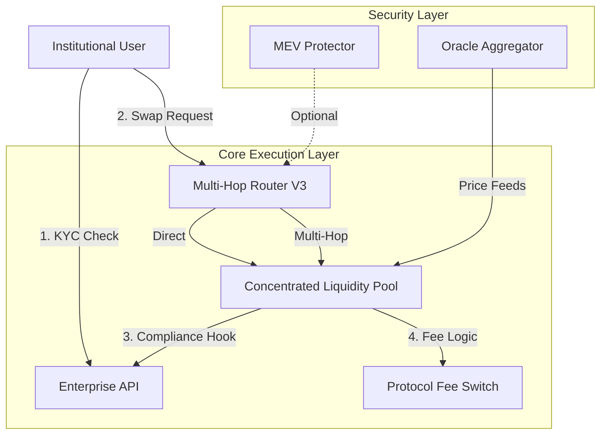

# Conxian Protocol Roadmap

**Last Updated**: January 2026

## Overview

This roadmap outlines the development phases and status of the Conxian Protocol.
The project is currently in the **Stabilization & Alignment Phase**, with a focus
on correctness, security, governance architecture, and alignment with
regulatory-style objectives.

## Current Execution Plan: Strategic Pillars (Q1 2026)

Derived from our "Unified System Roadmap", these are the immediate technical priorities.

### Pillar 1: Codebase Consolidation

* **Objective**: Eliminate redundant implementations and standardize core patterns.
* **Status**: In Progress
* **Action Items**:
  * [x] Identify conflicting Router implementations.
  * [x] Identify conflicting CLP implementations.
  * [ ] **Standardize Error Codes**: Migrate all contracts to use `contracts/errors/standard-errors.clar`.
  * [ ] **Unify Trait Definitions**: Ensure global consistency in SIP imports.

### Pillar 2: Institutional Hardening

* **Objective**: Verify and activate "Enterprise" features.
* **Status**: Pending
* **Action Items**:
  * **Audit `enterprise-api`**: Verify `compliance-hooks` block non-KYC'd addresses.
  * **MEV Integration**: Benchmark latency of `mev-protector`.
  * **Circuit Breakers**: Implement automated pause triggers for volatility.

### Pillar 3: Developer Experience

* **Objective**: Streamline integration for partners and developers.
* **Status**: Pending
* **Action Items**:
  * **SDK Generation**: Auto-generate TypeScript SDK from traits.
  * **Documentation**: Publish Unified Context diagram.
  * **Reg Test Suite**: Create "Compliance Test Suite" for regulatory scenarios.

---

## Phase 0: Technical Alpha & Nakamoto Alignment (Current Phase)

* **Objective**: Solidify the protocol's foundation by aligning all core components with the modular, facade-based
  architecture and ensuring full compliance with the upcoming Stacks Nakamoto upgrade.

* **Key Activities**:
  * **Architectural Integrity & Test Environment Stabilization**:
    * **Dependency Graph Overhaul**: Completed rewrite of `build_graph.py` and `align_contracts.py`.
    * **Circular Dependency Resolution**: Identified and resolved critical circular dependencies.
    * **Test Suite Status**: Stabilized test environment; focusing on individual contract logic fixes.

  * **Nakamoto Compliance**:
    * Audit contracts for `block-height` usage (rescale to 5s blocks).
    * Transition logic to `burn-block-height` where appropriate.
    * Integrate native sBTC protocol.

  * **Architectural Alignment**:
    * Refactor `enterprise-api.clar` to facade pattern.
    * Solidify `proposal-engine.clar`.

## Phase 1: Feature Hardening & Security (Planned)

* **Objective**: Move from "Technical Alpha" to "Beta".

* **Key Activities**:
  * **Contract Hardening**:
  * Production-grade `get-health-factor` (Lending).
  * Complete `concentrated-liquidity-pool.clar` math.
  * **Testing Infrastructure**:
  * Economic and security stress tests.
  * **Security & Monitoring**:
  * MEV protection, circuit breakers, oracle failure modes.

## Phase 2: Advanced Governance & Feature Completion (Planned)

* **Objective**: Operationalize the "board and automated executive" model.

* **Key Activities**:
  * **Lending & Risk**: Integrated liquidation engine.
  * **DEX**: Completed math and pools.
  * **Tokens**: Canonical emission rails.
  * **Governance**: Council NFTs and Roles aligned with `NAMING_STANDARDS`.
  * **Operations**: `conxian-operations-engine.clar` with deterministic policy logic.

## Phase 3: Scenario Testing & Regulatory Formalization (Planned)

* **Objective**: Prove robustness and regulatory alignment.

* **Key Activities**:
  * Multi-step economic scenario testing.
  * Governance quorum and lifecycle testing.
  * `REGULATORY_ALIGNMENT.md` mappings.

## Phase 4: Mainnet Launch (Planned)

* **Objective**: Launch on Stacks mainnet.

* **Key Activities**:
  * Deployment of core contracts.
  * DAO bootstrapping (Council NFTs).
  * Web Application launch.
  * Security Audit & Bug Bounty.

## Unified Context Architecture

