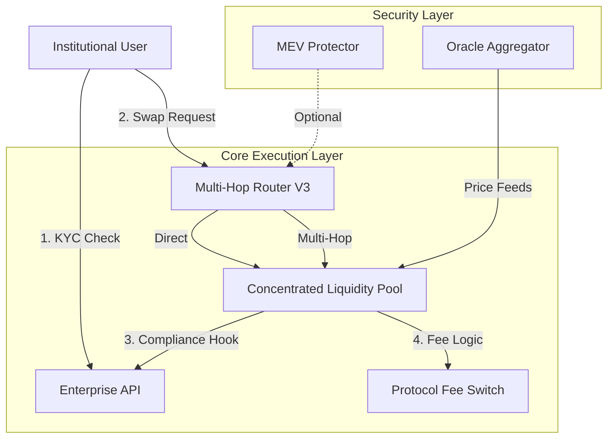

# Conxian Protocol Roadmap

**Last Updated**: January 2026

## Overview

This roadmap outlines the development phases and status of the Conxian Protocol. The project is currently in the **Stabilization & Alignment Phase**, with a focus on correctness, security, governance architecture, and alignment with regulatory-style objectives.

## Current Execution Plan: Strategic Pillars (Q1 2026)

Derived from our "Unified System Roadmap", these are the immediate technical priorities.

### Pillar 1: Codebase Consolidation

*   **Objective**: Eliminate redundant implementations and standardize core patterns.
*   **Status**: In Progress
*   **Action Items**:
    *   [x] Identify conflicting Router implementations.
    *   [x] Identify conflicting CLP implementations.
    *   [ ] **Standardize Error Codes**: Migrate all contracts to use `contracts/errors/standard-errors.clar`.
    *   [ ] **Unify Trait Definitions**: Ensure global consistency in SIP imports.

### Pillar 2: Institutional Hardening

*   **Objective**: Verify and activate "Enterprise" features.
*   **Status**: Pending
*   **Action Items**:
    *   **Audit `enterprise-api`**: Verify `compliance-hooks` block non-KYC'd addresses.
    *   **MEV Integration**: Benchmark latency of `mev-protector`.
    *   **Circuit Breakers**: Implement automated pause triggers for volatility.

### Pillar 3: Developer Experience

*   **Objective**: Streamline integration for partners and developers.
*   **Status**: Pending
*   **Action Items**:
    *   **SDK Generation**: Auto-generate TypeScript SDK from traits.
    *   **Documentation**: Publish Unified Context diagram.
    *   **Reg Test Suite**: Create "Compliance Test Suite" for regulatory scenarios.

---

## Phase 0: Technical Alpha & Nakamoto Alignment (Current Phase)

*   **Objective**: Solidify the protocol's foundation by aligning all core components with the modular, facade-based architecture and ensuring full compatibility with the upcoming Stacks Nakamoto upgrade. This phase is about building a stable, future-proof base for all subsequent development.

*   **Key Activities**:
    *   **Nakamoto Compatibility**:
        *   Audit all contracts for dependencies on `block-height` for time-based logic and rescale constants to align with faster block times.
        *   Transition long-term logic to `burn-block-height` where appropriate.
        *   Deprecate the custom BTC bridge and integrate the official, native sBTC protocol.
    *   **Architectural Alignment**:
        *   Refactor the `enterprise-facade.clar` from a prototype into a true facade, delegating logic to specialized manager contracts.
        *   Solidify the `proposal-engine.clar` as the central facade for governance and clearly define the interfaces for its manager contracts.
    *   **Documentation Overhaul**:
        *   Complete the comprehensive documentation alignment to ensure all `README.md` files and strategic documents accurately reflect the current state and target architecture of the protocol.
    *   **Testing Enhancements**:
        *   Configure the test environment to simulate Nakamoto block times.
        *   Expand test coverage to validate the refactored enterprise and governance modules.

## Phase 1: Feature Hardening & Security (Planned)

*   **Objective**: Move the protocol from a "Technical Alpha" to a "Beta" stage by hardening all existing features, expanding security measures, launching full retail mainnet and preparing for a formal audit for enterprise.

*   **Key Activities**:
    *   **Contract Hardening**:
        *   Implement a production-grade `get-health-factor` in the lending module.
        *   Complete the core math for the `concentrated-liquidity-pool.clar`.
        *   Harden all temporary stubs and controller hooks identified in Phase 0.
    *   **Testing Infrastructure**:
        *   Achieve comprehensive test coverage for all core modules, including economic and security stress tests.
        *   Harden the Vitest-based test harness for reliable execution of all test suites.
    *   **Security & Monitoring**:
        *   Implement and test advanced security features, including MEV protection, a robust circuit breaker, and oracle failure modes.
        *   Prepare detailed architecture diagrams and threat models for an external security review.

## Phase 2: Advanced Governance & Feature Completion (Planned)

*   **Objective**: Finish core protocol features and complete the governance / operational architecture so that Conxian can operate with a clear "board and automated executive" model.

*   **Key Activities**:

    *   **Lending & Risk Module**:
        *   Implement a production-grade `get-health-factor` in `comprehensive-lending-system.clar`, aligned with the risk and liquidation engines.
        *   Complete and integrate `liquidation-manager.clar` / `liquidation-engine.clar` for consistent margin checks and liquidations.
        *   Extend the existing risk and liquidation tests into full cross-module scenarios that bridge lending, oracle, circuit breaker, and liquidation behavior, including enterprise-style credit lines.

    *   **DEX Module**:
        *   Complete `concentrated-liquidity-pool.clar` and its core math.
        *   Integrate `dijkstra-pathfinder.clar` with `multi-hop-router-v3.clar` for efficient routing across pools.
        *   Ensure DEX fee flows are fully routed through `protocol-fee-switch.clar`.

    *   **Tokens & Emission Module**:
        *   Enable and harden integration hooks in `cxd-token.clar` for system-controller and emission-controller usage, subject to Clarity constraints.
        *   Complete `token-system-coordinator.clar` behavior and tests for cross-token coordination and system health views.
        *   Ensure `token-emission-controller.clar` is the canonical emission rail for CXD, CXVG, CXTR, and related tokens.

    *   **Governance Councils & Role NFTs**:
        *   Implement or refine council types and roles in `enhanced-governance-nft.clar` to match `NAMING_STANDARDS.md`.
        *   Ensure metadata for council membership NFTs uses descriptive, regulatory-friendly labels.

    *   **Conxian Automated Operations Seat**:
        *   Design and implement `conxian-operations-engine.clar` with deterministic on-chain policy logic.
        *   Reads metrics from various coordinators and modules.
        *   Casts votes via `proposal-engine.clar` as an on-chain contract principal.

    *   **Guardian Network & Automation Scaffolding**:
        *   Design and implement `guardian-registry.clar` for managing Guardian roles and bonding in CXD.
        *   Wire `keeper-coordinator.clar` and automation targets to enforce Guardian checks via a shared `automation-trait`.

    *   **Position NFTs & DAO Role NFTs**:
        *   Design NFT schemas and traits for LP positions, lending positions, and DAO roles.

    *   **Service Vaults & Treasury / Fee Routing**:
        *   Design a "service vault" pattern for holding CXD/CXTR to pay for on-chain services.

## Phase 3: Scenario Testing & Regulatory Formalization (Planned)

*   **Objective**: Prove system robustness via end-to-end scenarios and formal alignment of on-chain behavior with regulatory-style objectives.

*   **Key Activities**:
    *   **Cross-Domain Scenario Testing**:
        *   Implement multi-step economic scenarios that chain DEX, lending, protocol fees, and insurance.
        *   Test oracle failures, circuit breaker activation, and incident playbooks end-to-end.
    *   **Governance & Council Behavior**:
        *   Add tests for quorum, proposal lifecycle, council-based permissions, and the impact of the Conxian Operations Engine seat on governance outcomes.
    *   **Regulatory Alignment Extensions**:
        *   Extend `REGULATORY_ALIGNMENT.md` with more concrete mappings from specific contracts and tests to regulatory-style objectives and stress scenarios.

## Phase 4: Mainnet Launch (Planned)

*   **Objective**: Launch the Conxian Protocol on Stacks mainnet with a production-ready governance and operational model.

*   **Key Activities**:
    *   **Deployment**: Deploy all core contracts to mainnet.
    *   **Governance Bootstrapping**: Initialize the DAO with council membership NFTs.
    *   **Web Application & Tooling**: Launch the official web application with dashboards.
    *   **Security Audit & Bug Bounty**: Complete an external security audit and initiate a bug bounty program.

## Unified Context Architecture

