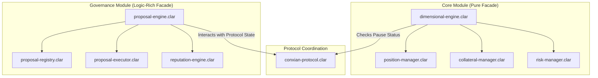

# Conxian Protocol: System Architecture

## 1. Overview

The Conxian Protocol is engineered with a modern, modular architecture designed to meet the demands of both retail and institutional DeFi. Our architectural philosophy is centered on three core principles:

- **Security**: Prioritizing the safety of user funds through battle-tested, clear, and auditable patterns.
- **Maintainability**: Ensuring the long-term health and scalability of the protocol by separating concerns and creating a clean, understandable codebase.
- **Extensibility**: Building a flexible foundation that allows for the seamless addition of new features and modules without compromising the stability of the core system.

To achieve these goals, the protocol is built upon two distinct but complementary architectural patterns: the **Pure Facade** and the **Logic-Rich Facade**.

## 2. Core Architectural Patterns

The Conxian Protocol uses a facade-based architecture to provide a secure and manageable interface to its complex underlying systems. However, we apply two different types of facades depending on the needs of the module.

### 2.1 Pattern 1: The Pure Facade (Core Module)

The "Pure Facade" pattern provides a simple, stateless, and highly secure entry point to a module's functionality. This pattern is used in the `core` module, where security and clarity are paramount.

- **How It Works**: The `dimensional-engine.clar` contract serves as the facade. It contains almost no business logic. Its sole responsibility is to perform critical pre-flight checks (e.g., is the protocol paused? is the user compliant?) and then delegate the call to the appropriate specialized manager contract.
- **Benefits**: This pattern offers the highest level of security by minimizing the attack surface. The logic is decentralized into single-responsibility contracts, making them easier to audit and maintain.

### 2.2 Pattern 2: The Logic-Rich Facade (Governance Module)

The "Logic-Rich Facade" pattern provides a centralized controller that manages a complex workflow. This pattern is used in the `governance` module, where the process itself is as important as the individual actions.

- **How It Works**: The `proposal-engine.clar` contract serves as the facade. Unlike a pure facade, it contains significant business logic related to the governance process. It manages the state of proposals, validates voting eligibility, and orchestrates the entire lifecycle of a proposal, while still delegating specific tasks like data storage (`proposal-registry`) and final execution (`proposal-executor`).
- **Benefits**: This pattern is ideal for complex, multi-step processes. It provides a single point of control and a clear, sequential workflow, which is essential for a secure and predictable governance system.

## 3. The Protocol Coordinator: `conxian-protocol.clar`

While the facade patterns decentralize the logic of individual modules, the Conxian Protocol is unified by a central coordinator contract: `conxian-protocol.clar`. This critical contract serves as the single source of truth for protocol-wide state and provides a global layer of security and control.

### 3.1 Key Responsibilities

- **Emergency Pause**: The coordinator implements a global `emergency-paused` flag. When this flag is active, all state-changing functions in the module facades are disabled.
- **Contract Registry**: The coordinator maintains a registry of all authorized module contracts, ensuring that only verified components can interact with the core system.
- **Protocol-Wide Configuration**: The coordinator manages global configuration parameters, providing a centralized point of control.

## 4. High-Level System Diagram

## 5. Module Breakdown

For a detailed understanding of each module's specific architecture and functionality, please refer to their individual `README.md` files:

- **[Core Module](../contracts/core/README.md)**: Manages dimensional trading, position management, and system-wide risk.
- **[DEX Module](../contracts/dex/README.md)**: Provides a decentralized exchange. (Status: Under Development)
- **[Lending Module](../contracts/lending/README.md)**: Manages decentralized lending and borrowing. (Status: Under Development)
- **[Governance Module](../contracts/governance/README.md)**: Provides the framework for decentralized decision-making and protocol upgrades.
- **[Enterprise Module](../contracts/enterprise/README.md)**: Provides institutional-grade financial tooling. (Status: Planned)

## 6. Architectural Goals: Nakamoto Compatibility

A primary architectural goal of the Conxian Protocol is to be fully compatible with the upcoming Stacks Nakamoto upgrade. This means that all contracts are being reviewed and designed to:

- **Handle Faster Block Times**: By avoiding dependencies on `block-height` for short-term time calculations and using `burn-block-height` for long-term, Bitcoin-aligned logic.
- **Integrate Native sBTC**: By deprecating custom bridge solutions in favor of the official, decentralized sBTC protocol.
- **Leverage Trustless Bitcoin State**: By using the `clarity-bitcoin` library to verify Bitcoin transactions on-chain.

This forward-looking approach ensures that the Conxian Protocol is not only secure and maintainable today, but is also built to last in the evolving Stacks ecosystem.
