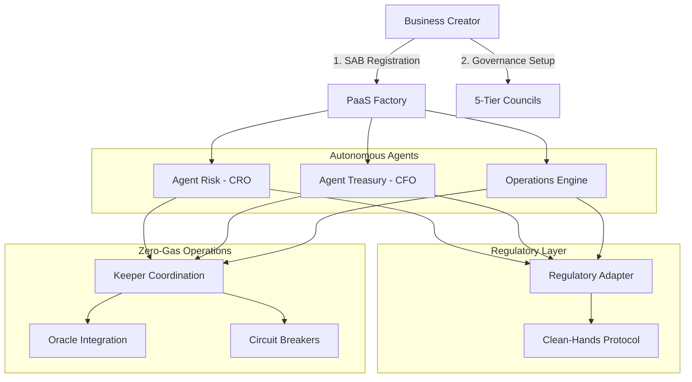

# Unified System Roadmap - SAB Ecosystem

**Date:** January 10, 2026
**Version:** 2.0

## 1. Vision

To establish Conxian as the premier **Sovereign Autonomous Business (SAB) ecosystem**
on Stacks, characterized by:

* **Zero-Gas Autonomous Operations**: Revolutionary regulatory handoff approach
  enabling cost-free automated operations
* **Multi-Agent Governance**: Human-AI collaboration through autonomous agents
  (Chief Risk Officer, Chief Financial Officer, Operations Engine)
* **Regulatory Compliance**: Clean-hands protocol with off-chain verification
* **Bitcoin-Anchored Security**: Full Bitcoin finality integration
* **Scalable Business Deployment**: One-click SAB creation through PaaS factory

## 2. Strategic Pillars

### Pillar 1: Autonomous Agent Integration (Month 1)

* **Objective**: Deploy and integrate all autonomous agents with zero-gas operations.
* **Action Items**:
  * [x] **Agent Risk Deployment**: sBTC peg monitoring and circuit breakers
  * [x] **Agent Treasury Deployment**: Automated revenue distribution
  * [x] **Operations Engine Deployment**: Multi-agent coordination
  * [ ] **Automation Manager Completion**: Keeper coordination system
  * [ ] **Zero-Gas Optimization**: Ensure all agents operate without gas costs

### Pillar 2: Regulatory Handoff Implementation (Month 2)

* **Objective**: Complete regulatory compliance through off-chain verification.
* **Action Items**:
  * [x] **Regulatory Adapter**: Clean-hands compliance verification
  * [x] **SIP-018 Integration**: Signed message verification
  * [ ] **Jurisdiction Support**: Multi-regulatory framework compatibility
  * [ ] **Compliance Test Suite**: Regulatory scenario testing
  * [ ] **Privacy Preservation**: PII off-chain while ensuring compliance

### Pillar 3: PaaS Factory Enhancement (Month 3)

* **Objective**: Complete one-click SAB deployment system.
* **Action Items**:
  * [ ] **SAB Template System**: Standardized business deployment templates
  * [ ] **Automated Configuration**: Business setup and compliance enforcement
  * [ ] **Metadata Management**: Business registration and tracking
  * [ ] **SDK Generation**: TypeScript SDK from SAB traits
  * [ ] **Developer Documentation**: SAB integration guides

## 3. SAB Architecture Overview

## 4. Autonomous Agent Capabilities

### 4.1 Chief Risk Officer (Agent Risk)

* **sBTC Peg Monitoring**: Real-time price deviation detection

* **Market Volatility Tracking**: Automated threshold monitoring
* **Circuit Breaker Control**: Emergency protocol activation
* **Zero-Gas Operations**: All monitoring through keeper calls

### 4.2 Chief Financial Officer (Agent Treasury)

* **Revenue Distribution**: 60% staking, 20% dev fund, 20% insurance

* **Capital Management**: Dynamic vault configuration
* **Compliance Integration**: Regulatory verification for all operations
* **Zero-Gas Operations**: Automated treasury management

### 4.3 Operations Engine

* **Executive Coordination**: Multi-agent coordination

* **Service Registry**: Zero-drift engineering management
* **Failsafe Protocols**: Emergency system management
* **Zero-Gas Operations**: Automated governance coordination

## 5. Regulatory Compliance Through Handoff

### 5.1 Clean-Hands Protocol

* **Off-Chain Verification**: ZK-proof and signature validation

* **Privacy Preservation**: PII remains off-chain
* **Jurisdiction Support**: Multi-regulatory framework compatibility
* **Zero-Gas Compliance**: No gas costs for verification

### 5.2 SIP-018 Integration

* **Standardized Messages**: Consistent signed message format

* **Authority Management**: Dynamic regulatory authority updates
* **Proof Validation**: Automated proof verification and storage
* **Compliance Registry**: User compliance status tracking

## 6. PaaS Factory Features

### 6.1 One-Click SAB Deployment

* **Automated Registration**: Business metadata management

* **Template Configuration**: Standardized SAB setup
* **Compliance Enforcement**: Conxian standard adherence
* **Gas-Free Creation**: Zero-gas SAB deployment

### 6.2 Business Management

* **Metadata Tracking**: Business registration and status

* **Configuration Management**: Dynamic business parameters
* **Compliance Monitoring**: Automated compliance checks
* **Revenue Routing**: Automated fee distribution

## 7. Zero-Gas Operations Architecture

### 7.1 Keeper Coordination

* **Automated Upkeep**: System health monitoring

* **Task Execution**: Automated agent operations
* **Health Monitoring**: Real-time system performance tracking
* **Service Management**: Zero-drift engineering

### 7.2 Oracle Integration

* **Price Feeds**: Real-time market data for agents

* **Risk Metrics**: Automated risk assessment data
* **Compliance Data**: Regulatory verification information
* **System Metrics**: Performance and health indicators

## 8. Immediate Next Steps

1. **Complete Automation Manager**: Finalize keeper coordination system
1. **Zero-Gas Optimization**: Ensure all agents operate without gas costs
1. **Jurisdiction Support**: Implement multi-regulatory framework
1. **SAB Templates**: Create standardized business deployment templates
1. **Compliance Testing**: Implement regulatory scenario test suite

## 9. Success Metrics

### 9.1 Technical Metrics

* **Zero-Error Compilation**: All contracts compile without errors

* **Zero-Gas Operations**: All autonomous agents operate without gas costs
* **Regulatory Compliance**: 100% off-chain verification success rate
* **System Uptime**: 99.9% automated system availability

### 9.2 Business Metrics

* **SAB Deployments**: Target 100+ SABs deployed per month

* **Agent Performance**: 24/7 autonomous operations
* **Compliance Rate**: 100% regulatory compliance verification
* **User Adoption**: Target 10,000+ active SAB users

### 9.3 Governance Metrics

* **Council Participation**: Active human and AI agent participation

* **Proposal Success**: 90%+ proposal execution success rate
* **Voting Engagement**: High participation in governance decisions
* **Autonomous Decisions**: 70%+ decisions made by autonomous agents
